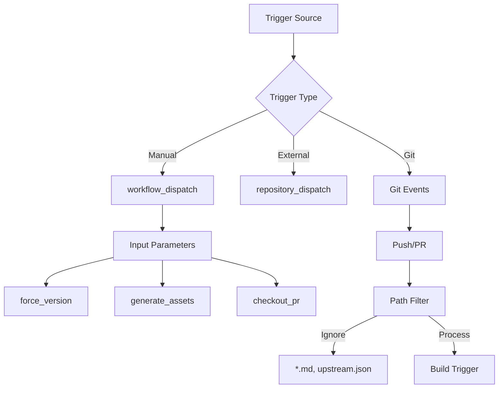
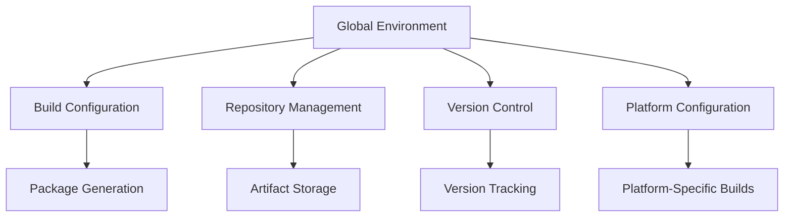
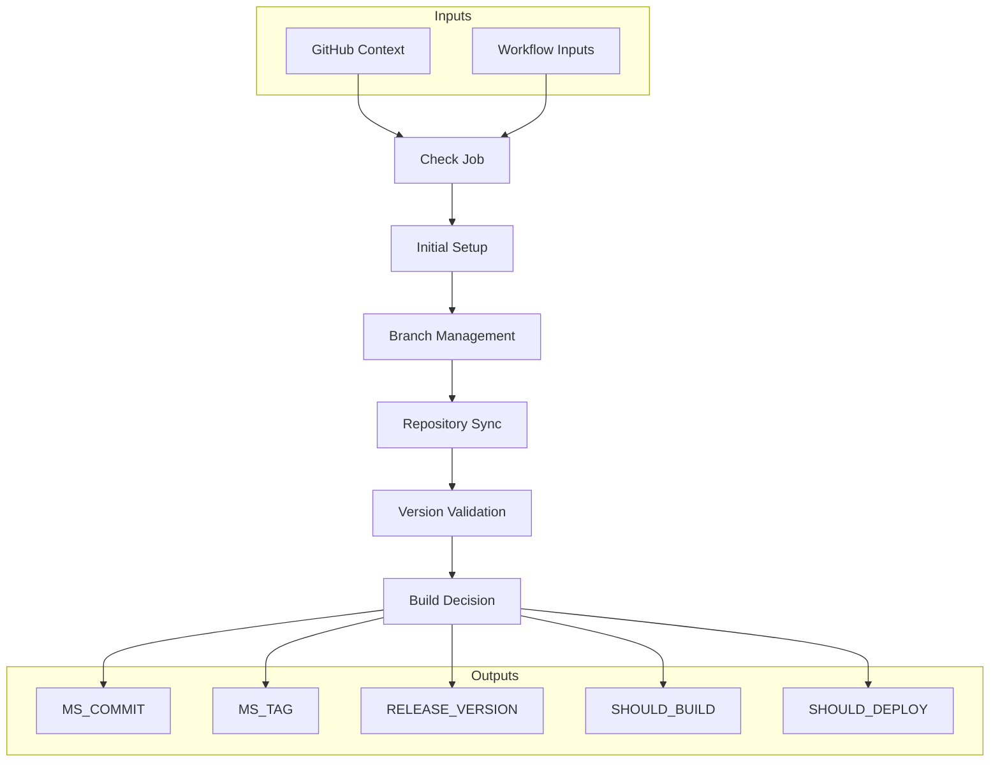
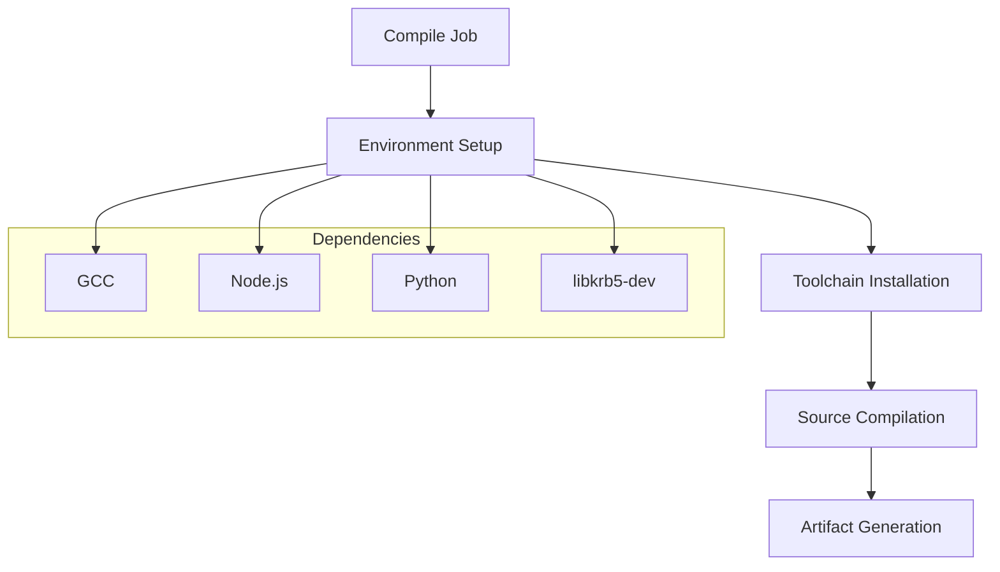
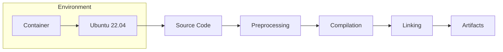
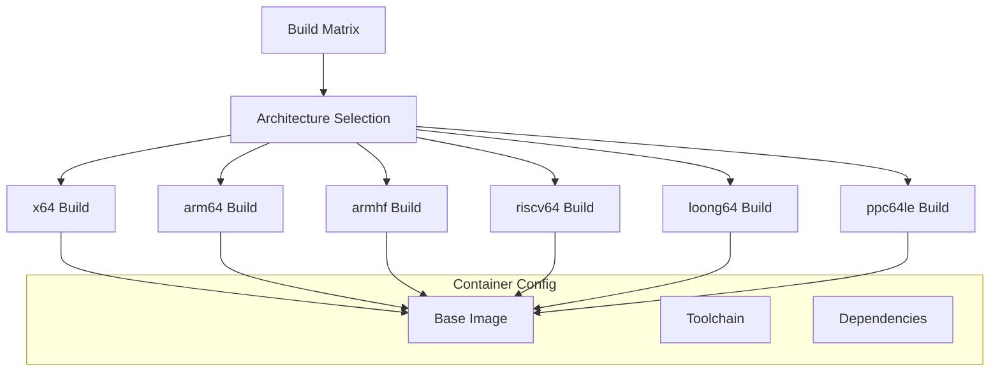
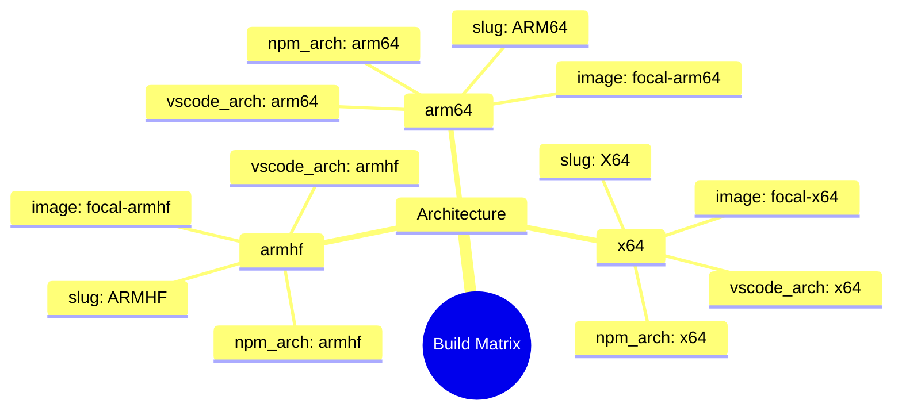
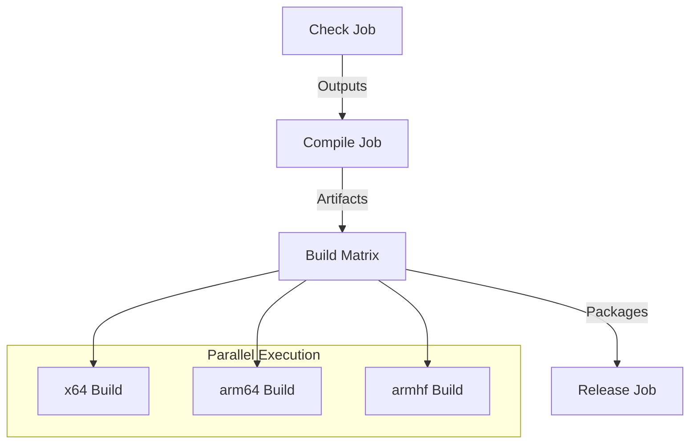
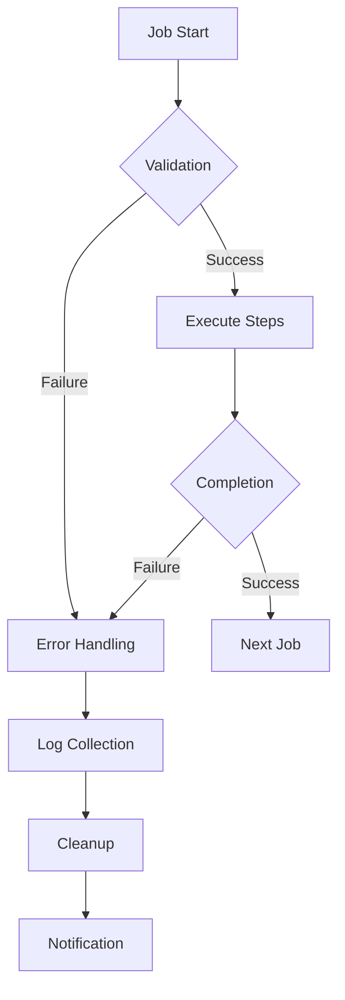
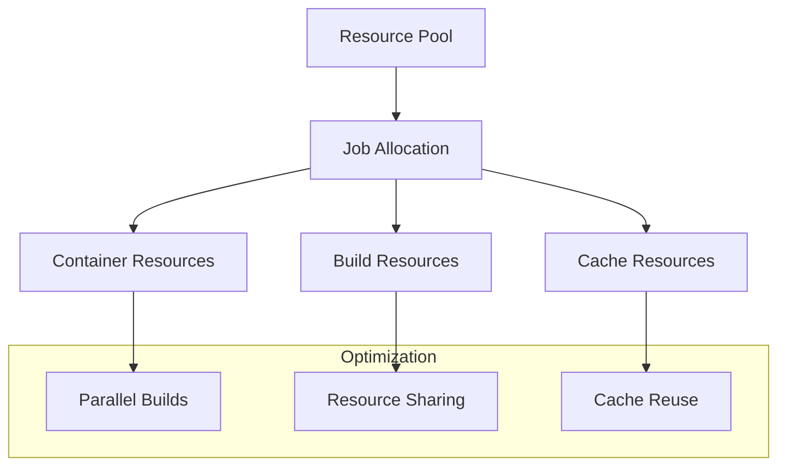

# VSCodium Linux Pipeline Technical Analysis

This document provides a comprehensive technical analysis of the VSCodium Linux build pipeline, breaking down each component and its role in the build process. The analysis is based on the `.github/workflows/stable-linux.yml` workflow file.

## Table of Contents
- [Workflow Structure](#workflow-structure)
- [Trigger System](#trigger-system)
- [Environment Configuration](#environment-configuration)
- [Job Architecture](#job-architecture)
- [Build Process](#build-process)
- [Package Management](#package-management)
- [Release Process](#release-process)
- [Security Considerations](#security-considerations)
- [Performance Optimization](#performance-optimization)
- [Error Handling](#error-handling)

## Workflow Structure

The workflow definition in `stable-linux.yml` establishes the conditions under which the pipeline will execute and the parameters it accepts. Let's break down each component in detail.

## 1. Workflow Name and Triggers

```yaml
name: stable-linux
on:
  workflow_dispatch:
    inputs:
      force_version:
        type: boolean
        description: Force update version
      generate_assets:
        type: boolean
        description: Generate assets
      checkout_pr:
        type: string
        description: Checkout PR
  repository_dispatch:
    types: [stable]
  push:
    branches: [ master ]
    paths-ignore:
    - '**/*.md'
    - 'upstream/*.json'
  pull_request:
    branches: [ master ]
    paths-ignore:
    - '**/*.md'
```

### 1.1 Manual Trigger (`workflow_dispatch`)
The workflow can be manually triggered with three configurable inputs:

1. **force_version**
   - Type: boolean
   - Purpose: Forces a version update regardless of existing tags
   - Use Case: When you need to rebuild and release with the same version number
   - Example: After fixing a critical bug in a release

2. **generate_assets**
   - Type: boolean
   - Purpose: Generates build artifacts without releasing them
   - Use Case: Testing builds or preparing for a future release
   - Example: Creating test builds for QA

3. **checkout_pr**
   - Type: string
   - Purpose: Allows building from a specific pull request
   - Use Case: Testing PR changes before merging
   - Example: Verifying fixes in a feature branch

### 1.2 Repository Dispatch (`repository_dispatch`)
```yaml
repository_dispatch:
  types: [stable]
```
- **Purpose:** Allows triggering the workflow from external events
- **Types:** Only accepts 'stable' type events
- **Use Case:** Integration with other workflows or automated systems
- **Example:** Triggering builds from a version management system

### 1.3 Git Event Triggers

#### Push Events
```yaml
push:
  branches: [ master ]
  paths-ignore:
  - '**/*.md'
  - 'upstream/*.json'
```
- **Branches:** Only triggers on pushes to the master branch
- **Path Filters:**
  - Ignores markdown file changes (`**/*.md`)
  - Ignores upstream JSON changes (`upstream/*.json`)
- **Purpose:** Prevents unnecessary builds for documentation or configuration updates

#### Pull Request Events
```yaml
pull_request:
  branches: [ master ]
  paths-ignore:
  - '**/*.md'
```
- **Branches:** Only triggers on PRs targeting master
- **Path Filters:** Ignores markdown file changes
- **Purpose:** Ensures PRs are tested before merging

## 2. Trigger Flow Analysis



## 3. Trigger Priority and Handling

### 3.1 Priority Order
1. Manual dispatch (highest priority)
2. Repository dispatch
3. Git events (push/PR)

### 3.2 Conflict Resolution
- Manual triggers override automated ones
- Repository dispatch takes precedence over Git events
- Git events are processed in order of arrival

### 3.3 Conditional Execution
```yaml
if: needs.check.outputs.SHOULD_BUILD == 'yes' || github.event.inputs.generate_assets == 'true'
```
- Jobs only execute if:
  - The check job determines a build is needed
  - OR manual trigger with generate_assets is true

## 4. Security Considerations

### 4.1 Input Validation
- Boolean inputs are strictly typed
- String inputs are validated by the workflow
- Path filters prevent unauthorized file access

### 4.2 Access Control
- Manual triggers require repository write access
- Repository dispatch requires proper authentication
- Git events are subject to branch protection rules

## 5. Best Practices Implementation

### 5.1 Path Filtering
- Excludes documentation changes
- Prevents unnecessary builds
- Reduces resource consumption

### 5.2 Input Management
- Clear descriptions for manual inputs
- Type safety for all inputs
- Default values where appropriate

### 5.3 Error Prevention
- Strict branch targeting
- Clear path exclusions
- Input validation

## 6. Common Use Cases

### 6.1 Regular Development
```yaml
# Triggered by:
push:
  branches: [ master ]
  paths-ignore:
  - '**/*.md'
```

### 6.2 Release Management
```yaml
# Triggered by:
workflow_dispatch:
  inputs:
    force_version: true
    generate_assets: true
```

### 6.3 PR Testing
```yaml
# Triggered by:
pull_request:
  branches: [ master ]
  paths-ignore:
  - '**/*.md'
```

---

*This detailed analysis of the workflow definition provides insights into how the pipeline is triggered and managed. Understanding these mechanisms is crucial for effective pipeline maintenance and troubleshooting.*

### 2. Global Environment


The global environment section defines variables that are available throughout the entire workflow. These variables control various aspects of the build process, from naming conventions to repository management.

```yaml
env:
  ACTIONS_ALLOW_USE_UNSECURE_NODE_VERSION: true
  APP_NAME: VSCodium
  ASSETS_REPOSITORY: ${{ github.repository }}
  BINARY_NAME: codium
  DISABLE_UPDATE: 'yes'
  GH_REPO_PATH: ${{ github.repository }}
  ORG_NAME: ${{ github.repository_owner }}
  OS_NAME: linux
  VERSIONS_REPOSITORY: ${{ github.repository_owner }}/versions
  VSCODE_QUALITY: stable
```

### 2. Variable Analysis

#### 2.1 Build Configuration
```yaml
ACTIONS_ALLOW_USE_UNSECURE_NODE_VERSION: true
```
- **Purpose:** Allows the use of Node.js versions that might be considered insecure
- **Impact:** Enables compatibility with specific Node.js versions required by the build
- **Security Note:** Should be used with caution and only when necessary

```yaml
APP_NAME: VSCodium
BINARY_NAME: codium
```
- **Purpose:** Defines the application and binary names
- **Usage:** Used in package naming, file generation, and release artifacts
- **Consistency:** Ensures consistent naming across all build outputs

#### 2.2 Repository Management
```yaml
ASSETS_REPOSITORY: ${{ github.repository }}
GH_REPO_PATH: ${{ github.repository }}
ORG_NAME: ${{ github.repository_owner }}
```
- **Dynamic Values:** Uses GitHub context variables
- **Purpose:** 
  - `ASSETS_REPOSITORY`: Where build artifacts are stored
  - `GH_REPO_PATH`: Source repository path
  - `ORG_NAME`: Organization or user name
- **Example Values:**
  - Repository: `VSCodium/vscodium`
  - Organization: `VSCodium`

#### 2.3 Version Control
```yaml
VERSIONS_REPOSITORY: ${{ github.repository_owner }}/versions
DISABLE_UPDATE: 'yes'
```
- **Purpose:**
  - `VERSIONS_REPOSITORY`: Tracks version information
  - `DISABLE_UPDATE`: Controls automatic updates
- **Usage:** Manages version tracking and update behavior

#### 2.4 Platform Configuration
```yaml
OS_NAME: linux
VSCODE_QUALITY: stable
```
- **Purpose:** Defines build platform and quality level
- **Values:**
  - `OS_NAME`: Specifies the target operating system
  - `VSCODE_QUALITY`: Indicates build quality (stable/beta/insider)

### 3. Environment Variable Flow



### 4. Variable Inheritance and Scope

#### 4.1 Inheritance Rules
- Global variables are available to all jobs
- Job-specific variables can override global ones
- Matrix variables take precedence over job variables

#### 4.2 Scope Examples
```yaml
# Global scope
env:
  APP_NAME: VSCodium

# Job-specific override
jobs:
  build:
    env:
      APP_NAME: VSCodium-Custom
```

### 5. Security Considerations

#### 5.1 Sensitive Information
- No sensitive data in global environment
- Secrets are managed through GitHub Secrets
- Repository paths use GitHub context variables

#### 5.2 Access Control
- Variables are read-only during execution
- Cannot be modified by workflow steps
- Protected by GitHub's security model

### 6. Best Practices

#### 6.1 Variable Naming
- Use uppercase for environment variables
- Clear, descriptive names
- Consistent naming conventions

#### 6.2 Value Management
- Use GitHub context where possible
- Avoid hardcoded values
- Document variable purposes

#### 6.3 Error Prevention
- Validate variable values
- Provide fallback values where needed
- Document required variables

### 7. Common Use Cases

#### 7.1 Package Generation
```yaml
# Using environment variables in package naming
package_name: ${{ env.APP_NAME }}-${{ env.VSCODE_QUALITY }}
```

#### 7.2 Artifact Management
```yaml
# Using repository variables for artifact storage
artifact_path: ${{ env.ASSETS_REPOSITORY }}/releases
```

#### 7.3 Version Control
```yaml
# Using version repository for tracking
version_file: ${{ env.VERSIONS_REPOSITORY }}/versions.json
```

### 8. Troubleshooting

#### 8.1 Common Issues
- Variable not found
- Incorrect value type
- Scope conflicts

#### 8.2 Debugging Steps
1. Check variable spelling
2. Verify scope
3. Validate GitHub context
4. Check job overrides

---

*This detailed analysis of the global environment configuration provides insights into how variables are managed and used throughout the workflow. Understanding these mechanisms is crucial for effective pipeline maintenance and customization.*

## Job Architecture

### 1. Check Job

#### 1.1 Purpose and Overview
The Check Job serves as the initial validation and setup phase of the pipeline. It performs critical pre-build checks and determines whether the build process should proceed. This job acts as a gatekeeper, ensuring that only valid and necessary builds are initiated.

#### 1.2 Job Configuration
```yaml
check:
  name: Check
  runs-on: ubuntu-latest
  outputs:
    MS_COMMIT: ${{ steps.check_tags.outputs.MS_COMMIT }}
    MS_TAG: ${{ steps.check_tags.outputs.MS_TAG }}
    RELEASE_VERSION: ${{ steps.check_tags.outputs.RELEASE_VERSION }}
    SHOULD_BUILD: ${{ steps.check_tags.outputs.SHOULD_BUILD }}
    SHOULD_DEPLOY: ${{ steps.check_tags.outputs.SHOULD_DEPLOY }}
```

- **Key Components:**
  ```yaml
  steps:
    - uses: actions/checkout@v4
    - name: Switch to relevant branch
      run: ./get_pr.sh
    - name: Clone VSCode repo
      run: ./get_repo.sh
    - name: Check PR or cron
      run: ./check_cron_or_pr.sh
    - name: Check existing VSCodium tags/releases
      run: ./check_tags.sh
  ```


****
- **Outputs:**
  - MS_COMMIT
  - MS_TAG
  - RELEASE_VERSION
  - SHOULD_BUILD
  - SHOULD_DEPLOY

### 2. Compile Job
- **Purpose:** Core compilation process
- **Runner:** `ubuntu-22.04`





- **Dependencies:**
  ```yaml
  steps:
    - name: Setup GCC
      uses: egor-tensin/setup-gcc@v1
    - name: Setup Node.js environment
      uses: actions/setup-node@v4
    - name: Setup Python 3
      uses: actions/setup-python@v5
    - name: Install libkrb5-dev
      run: sudo apt-get update -y && sudo apt-get install -y libkrb5-dev
  ```
- **Artifact Generation:**
  ```yaml
  - name: Compress vscode artifact
    run: |
      find vscode -type f -not -path "*/node_modules/*" > vscode.txt
      tar -czf vscode.tar.gz -T vscode.txt
  ```

### 3. Build Matrix Job
- **Purpose:** Multi-architecture builds





- **Strategy:**
  ```yaml
  strategy:
    fail-fast: false
    matrix:
      include:
      - slug: X64
        vscode_arch: x64
        npm_arch: x64
        image: vscodium/vscodium-linux-build-agent:focal-x64
      # Additional architectures...
  ```
- **Container Configuration:**
  ```yaml
  container:
    image: ${{ matrix.image }}
  ```

### 4. Job Dependencies



### 5. Error Handling Flow



### 6. Resource Management



## Package Management

### 1. Package Types
- **Debian/Ubuntu (.deb)**
- **RPM (.rpm)**
- **AppImage**
- **Snap**
- **AUR (Arch Linux)**

### 2. Package Generation
```yaml
- name: Build
  env:
    GITHUB_TOKEN: ${{ secrets.GITHUB_TOKEN }}
    npm_config_arch: ${{ matrix.npm_arch }}
  run: ./build/linux/package_bin.sh
```

## Release Process

### 1. Release Preparation
```yaml
- name: Prepare assets
  run: ./prepare_assets.sh
```

### 2. Release Execution
```yaml
- name: Release
  env:
    GITHUB_TOKEN: ${{ secrets.STRONGER_GITHUB_TOKEN }}
    GITHUB_USERNAME: ${{ github.repository_owner }}
  run: ./release.sh
```

### 3. Version Management
```yaml
- name: Update versions repo
  env:
    FORCE_UPDATE: ${{ github.event.inputs.force_version }}
    GITHUB_TOKEN: ${{ secrets.STRONGER_GITHUB_TOKEN }}
  run: ./update_version.sh
```

## Security Considerations

### 1. Token Management
- GITHUB_TOKEN for basic operations
- STRONGER_GITHUB_TOKEN for sensitive operations
- AUR_PRIVATE_KEY for Arch Linux releases
- SNAP_STORE_LOGIN for Snapcraft releases

### 2. Container Security
- Minimal base images
- Isolated build environments
- Architecture-specific containers

## Performance Optimization

### 1. Caching Strategy
- Node.js module caching
- Python package caching
- Build artifact caching

### 2. Parallel Execution
- Matrix builds for multiple architectures
- Independent job execution
- Resource optimization

## Error Handling

### 1. Pre-build Validation
- Version conflict detection
- Dependency verification
- Environment checks

### 2. Build-time Recovery
- Retry mechanisms
- Cleanup procedures
- Log collection

### 3. Post-build Verification
- Package integrity checks
- Installation testing
- Basic functionality validation

---

*This technical analysis provides a foundation for understanding the VSCodium Linux build pipeline. For specific implementation details, refer to the actual workflow file and related documentation.*
