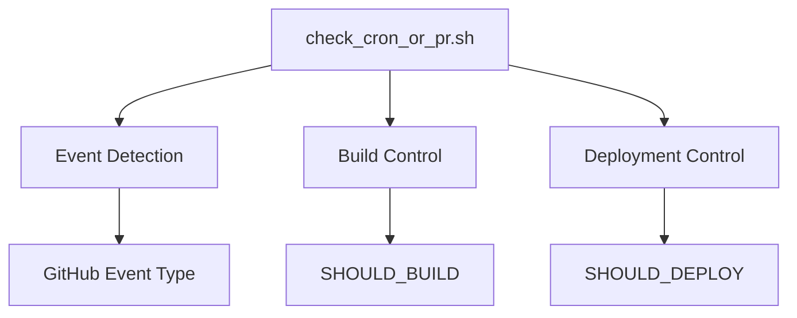
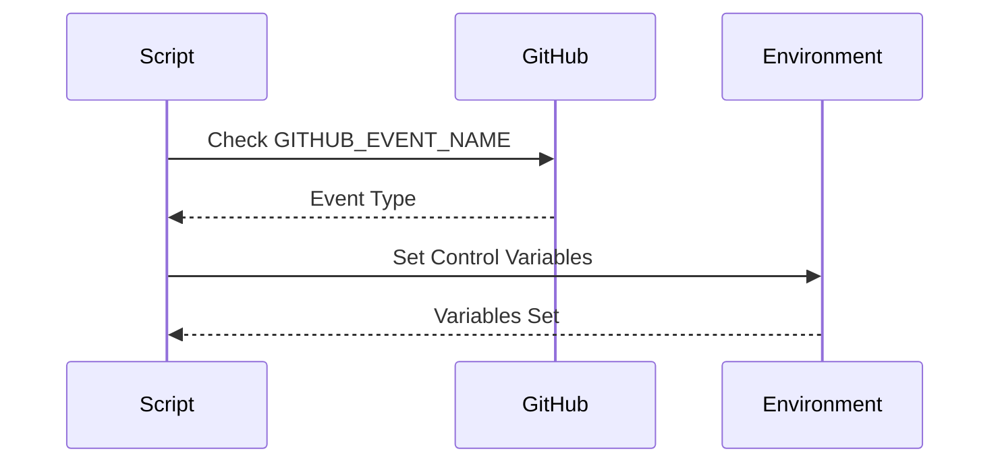
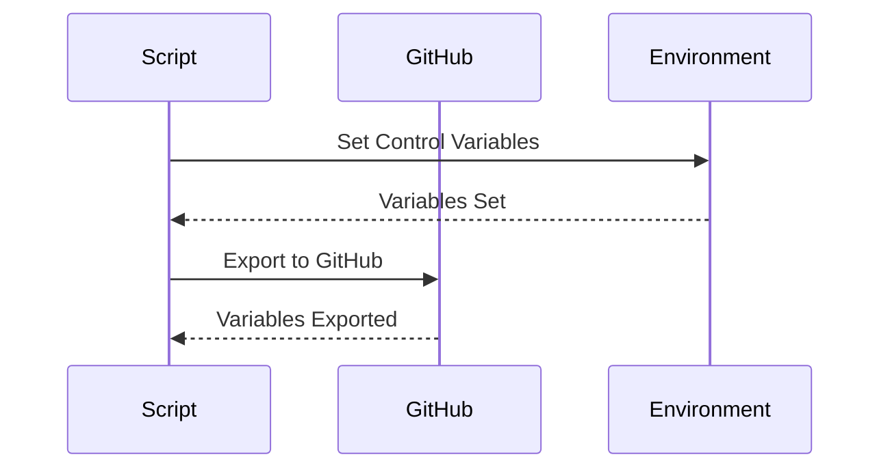
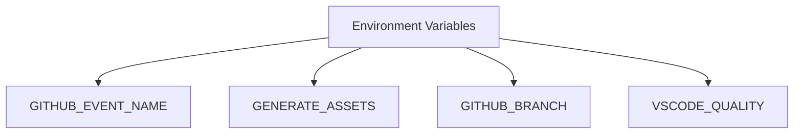
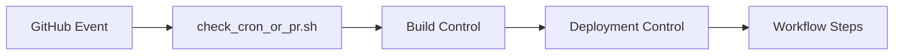
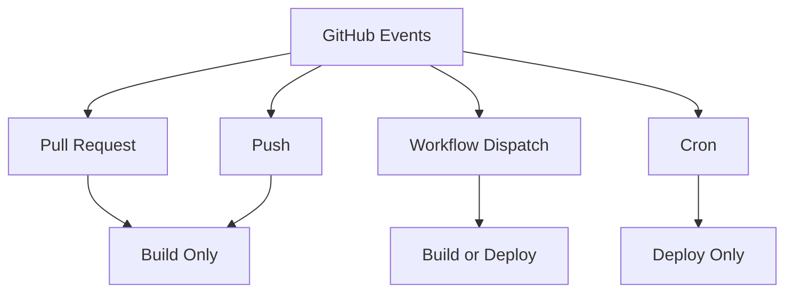
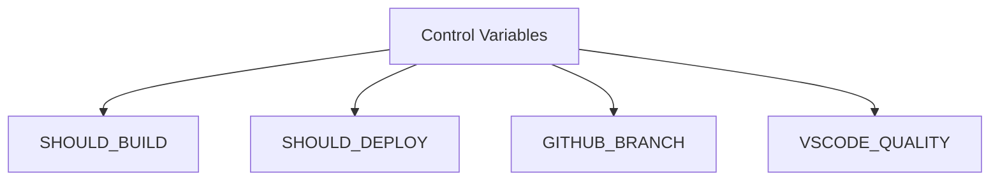
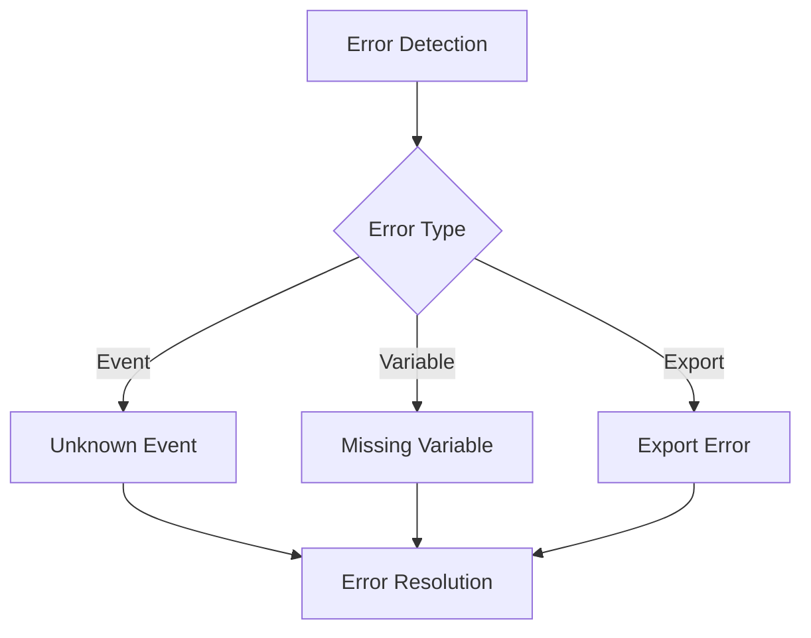

# check_cron_or_pr.sh Documentation

## Overview
The `check_cron_or_pr.sh` script is a critical component of the VSCodium build pipeline that determines the build and deployment behavior based on GitHub event types. It manages workflow control by setting appropriate environment variables for build and deployment actions.

## Table of Contents
- [Purpose](#purpose)
- [Script Analysis](#script-analysis)
- [Workflow Integration](#workflow-integration)
- [Event Handling](#event-handling)
- [Environment Variables](#environment-variables)
- [Error Handling](#error-handling)
- [Best Practices](#best-practices)

## Purpose

The script serves three main purposes:
1. **Event Detection**: Identifies the type of GitHub event triggering the workflow
2. **Build Control**: Determines whether to trigger the build process
3. **Deployment Control**: Manages deployment decisions based on event context



## Script Analysis

### 1. Event Detection



#### Code Analysis
```bash
if [[ "${GITHUB_EVENT_NAME}" == "pull_request" ]]; then
    echo "It's a PR"
    export SHOULD_BUILD="yes"
    export SHOULD_DEPLOY="no"
elif [[ "${GITHUB_EVENT_NAME}" == "push" ]]; then
    echo "It's a Push"
    export SHOULD_BUILD="yes"
    export SHOULD_DEPLOY="no"
elif [[ "${GITHUB_EVENT_NAME}" == "workflow_dispatch" ]]; then
    if [[ "${GENERATE_ASSETS}" == "true" ]]; then
        echo "It will generate the assets"
        export SHOULD_BUILD="yes"
        export SHOULD_DEPLOY="no"
    else
        echo "It's a Dispatch"
        export SHOULD_DEPLOY="yes"
    fi
else
    echo "It's a Cron"
    export SHOULD_DEPLOY="yes"
fi
```

- **Purpose**: Determines workflow behavior based on GitHub event type
- **Components**:
  - GitHub event type detection
  - Build control variable setting
  - Deployment control variable setting
- **Event Types**:
  - Pull Request
  - Push
  - Workflow Dispatch
  - Cron

### 2. Environment Variable Management



#### Code Analysis
```bash
if [[ "${GITHUB_ENV}" ]]; then
    echo "GITHUB_BRANCH=${GITHUB_BRANCH}" >> "${GITHUB_ENV}"
    echo "SHOULD_BUILD=${SHOULD_BUILD}" >> "${GITHUB_ENV}"
    echo "SHOULD_DEPLOY=${SHOULD_DEPLOY}" >> "${GITHUB_ENV}"
    echo "VSCODE_QUALITY=${VSCODE_QUALITY}" >> "${GITHUB_ENV}"
fi
```

- **Purpose**: Manages environment variables for workflow control
- **Components**:
  - GitHub environment file handling
  - Variable export
  - Workflow control variables

## Workflow Integration

### 1. Input Variables



- **GITHUB_EVENT_NAME**: Type of GitHub event
- **GENERATE_ASSETS**: Asset generation flag
- **GITHUB_BRANCH**: Current branch name
- **VSCODE_QUALITY**: Build quality setting

### 2. Integration Points



- **Trigger**: GitHub event execution
- **Output**: Control variables for workflow
- **Dependencies**: GitHub environment
- **Next Steps**: Build or deployment process

## Event Handling

### 1. Event Types



- **Pull Request**: Build only, no deployment
- **Push**: Build only, no deployment
- **Workflow Dispatch**: Build or deploy based on GENERATE_ASSETS
- **Cron**: Deploy only

### 2. Control Flow
- Event type detection
- Build decision making
- Deployment decision making
- Environment variable management

## Environment Variables

### 1. Control Variables



- **SHOULD_BUILD**: Controls build process
- **SHOULD_DEPLOY**: Controls deployment process
- **GITHUB_BRANCH**: Current branch information
- **VSCODE_QUALITY**: Build quality setting

### 2. Variable Management
- Environment variable setting
- GitHub environment export
- Workflow control

## Error Handling

### 1. Error Scenarios



### 2. Error Prevention
- Event type validation
- Environment variable checks
- Export verification
- Default behavior handling

## Best Practices

### 1. Configuration
- Clear event type handling
- Explicit variable setting
- Proper error handling
- Logging and debugging

### 2. Error Handling
- Early error detection
- Clear error messages
- Graceful failure handling

### 3. Performance
- Minimal variable operations
- Efficient condition checking
- Optimized control flow

## Common Issues and Solutions

### 1. Event Type Issues
- **Problem**: Unknown event type
- **Solution**: Default to cron behavior

### 2. Variable Issues
- **Problem**: Missing environment variables
- **Solution**: Default value handling

### 3. Export Issues
- **Problem**: GitHub environment export failure
- **Solution**: Error logging and notification

## Usage Examples

### 1. Basic Usage
```bash
export GITHUB_EVENT_NAME=pull_request
./check_cron_or_pr.sh
```

### 2. Custom Configuration
```bash
export GITHUB_EVENT_NAME=workflow_dispatch
export GENERATE_ASSETS=true
./check_cron_or_pr.sh
```

## Maintenance

### 1. Version Control
- Track script changes
- Document modifications
- Test updates

### 2. Testing
- Event type testing
- Variable handling testing
- Export testing

---

*This documentation provides a comprehensive overview of the check_cron_or_pr.sh script, its functionality, and integration within the VSCodium build pipeline.* 