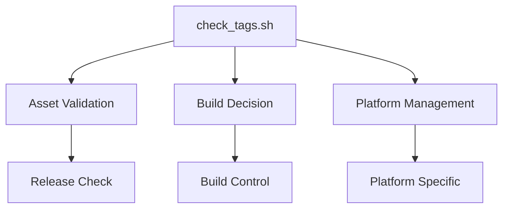
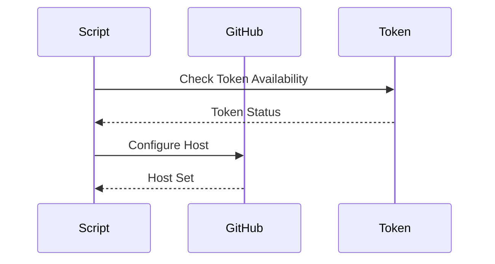
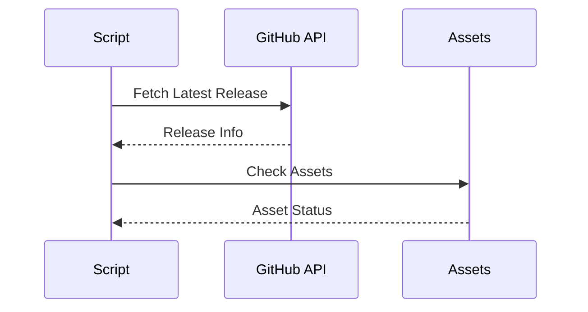
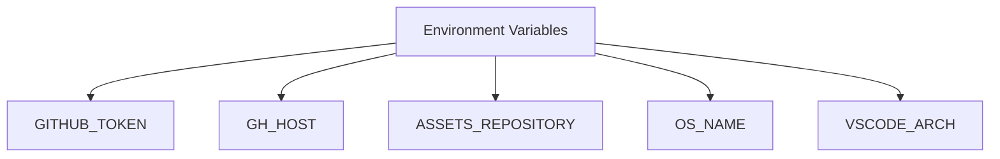
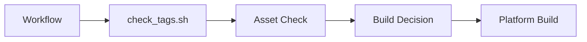
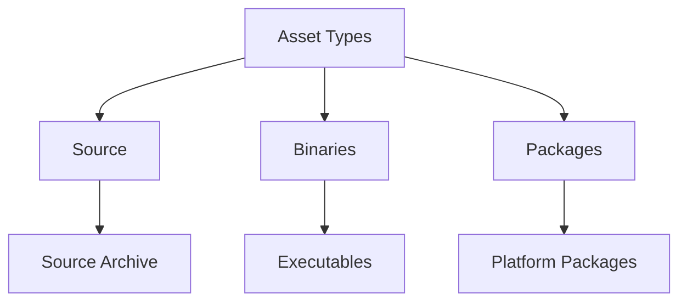
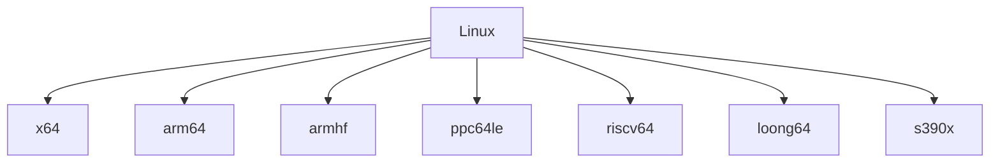
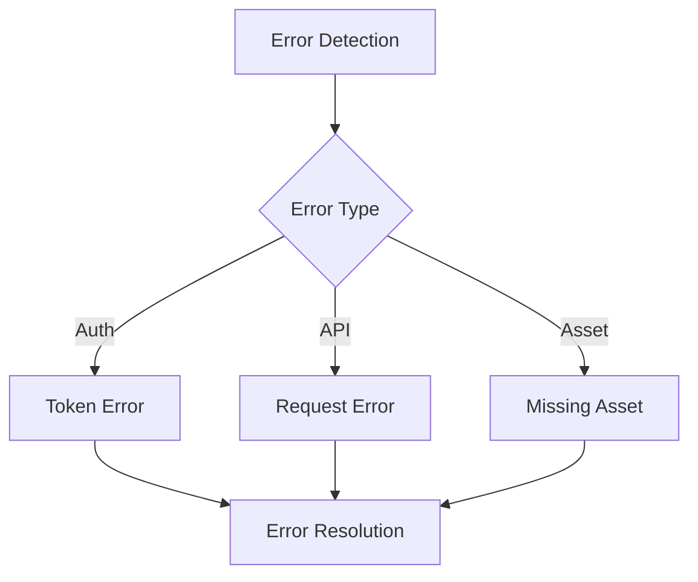

# check_tags.sh Documentation

## Overview
The `check_tags.sh` script is a critical component of the VSCodium build pipeline that manages asset checking and build decisions based on existing releases and platform-specific requirements. It handles complex asset validation across multiple platforms and architectures.

## Table of Contents
- [Purpose](#purpose)
- [Script Analysis](#script-analysis)
- [Workflow Integration](#workflow-integration)
- [Asset Management](#asset-management)
- [Platform Support](#platform-support)
- [Error Handling](#error-handling)
- [Best Practices](#best-practices)

## Purpose

The script serves three main purposes:
1. **Asset Validation**: Checks for existing release assets across different platforms
2. **Build Decision**: Determines whether new builds are required
3. **Platform Management**: Handles platform-specific build requirements



## Script Analysis

### 1. Authentication and Setup



#### Code Analysis
```bash
if [[ -z "${GH_TOKEN}" ]] && [[ -z "${GITHUB_TOKEN}" ]] && [[ -z "${GH_ENTERPRISE_TOKEN}" ]] && [[ -z "${GITHUB_ENTERPRISE_TOKEN}" ]]; then
  echo "Will not build because no GITHUB_TOKEN defined"
  exit 0
else
  GITHUB_TOKEN="${GH_TOKEN:-${GITHUB_TOKEN:-${GH_ENTERPRISE_TOKEN:-${GITHUB_ENTERPRISE_TOKEN}}}}"
fi

GH_HOST="${GH_HOST:-github.com}"
```

- **Purpose**: Handles authentication and environment setup
- **Components**:
  - Token validation
  - GitHub host configuration
  - Enterprise support

### 2. Release Asset Checking



#### Code Analysis
```bash
GITHUB_RESPONSE=$( curl -s -H "Authorization: token ${GITHUB_TOKEN}" "https://api.${GH_HOST}/repos/${ASSETS_REPOSITORY}/releases/latest" )
LATEST_VERSION=$( echo "${GITHUB_RESPONSE}" | jq -c -r '.tag_name' )
```

- **Purpose**: Manages release asset validation
- **Components**:
  - GitHub API integration
  - Asset checking
  - Version comparison

## Workflow Integration

### 1. Input Variables



- **GITHUB_TOKEN**: Authentication token
- **GH_HOST**: GitHub host configuration
- **ASSETS_REPOSITORY**: Target repository
- **OS_NAME**: Operating system
- **VSCODE_ARCH**: Architecture

### 2. Integration Points



- **Trigger**: Build workflow execution
- **Output**: Build control variables
- **Dependencies**: GitHub API access
- **Next Steps**: Platform-specific builds

## Asset Management

### 1. Asset Types



- **Source**: Source code archives
- **Binaries**: Platform-specific executables
- **Packages**: Distribution packages

### 2. Platform Assets
- Linux packages (DEB, RPM, TAR)
- Windows installers (EXE, MSI)
- macOS packages (DMG, ZIP)
- Remote Execution Host (REH) archives

## Platform Support

### 1. Linux Support



- **x64**: Standard x86_64 support
- **arm64**: ARM 64-bit support
- **armhf**: ARM hard-float support
- **ppc64le**: PowerPC support
- **riscv64**: RISC-V support
- **loong64**: LoongArch support
- **s390x**: IBM System z support

### 2. Windows Support
- x64 architecture
- ia32 architecture
- arm64 architecture
- System and User installers
- MSI packages

### 3. macOS Support
- Universal binaries
- DMG packages
- ZIP archives
- REH support

## Error Handling

### 1. Error Scenarios



### 2. Error Prevention
- Token validation
- API error handling
- Asset existence checks
- Platform-specific validation

## Best Practices

### 1. Configuration
- Secure token handling
- Platform-specific checks
- Asset validation
- Error handling

### 2. Error Handling
- Early error detection
- Clear error messages
- Graceful failure handling

### 3. Performance
- Efficient API calls
- Optimized asset checking
- Platform-specific optimizations

## Common Issues and Solutions

### 1. Authentication Issues
- **Problem**: Missing or invalid token
- **Solution**: Proper token configuration

### 2. Asset Issues
- **Problem**: Missing required assets
- **Solution**: Trigger appropriate builds

### 3. Platform Issues
- **Problem**: Unsupported platform
- **Solution**: Platform-specific handling

## Usage Examples

### 1. Basic Usage
```bash
export GITHUB_TOKEN=your_token
export OS_NAME=linux
export VSCODE_ARCH=x64
./check_tags.sh
```

### 2. Custom Configuration
```bash
export GH_HOST=github.enterprise.com
export ASSETS_REPOSITORY=owner/repo
export CHECK_ALL=yes
./check_tags.sh
```

## Maintenance

### 1. Version Control
- Track script changes
- Document modifications
- Test updates

### 2. Testing
- Platform testing
- Asset checking testing
- Error case testing

---

*This documentation provides a comprehensive overview of the check_tags.sh script, its functionality, and integration within the VSCodium build pipeline.* 