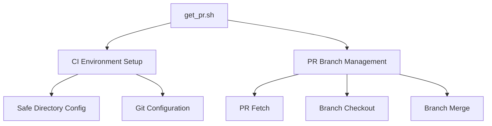
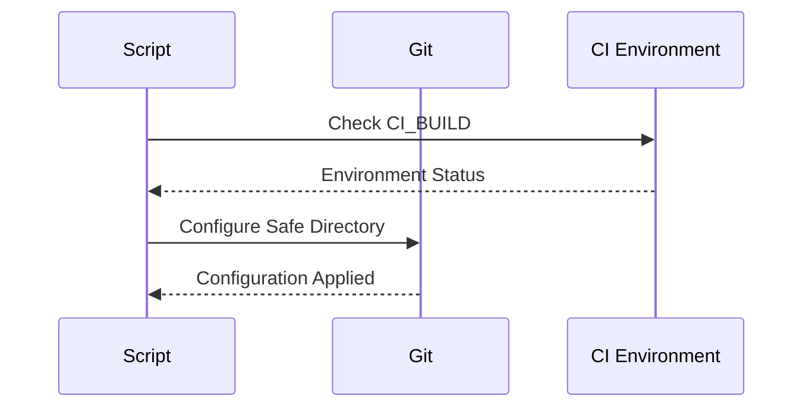
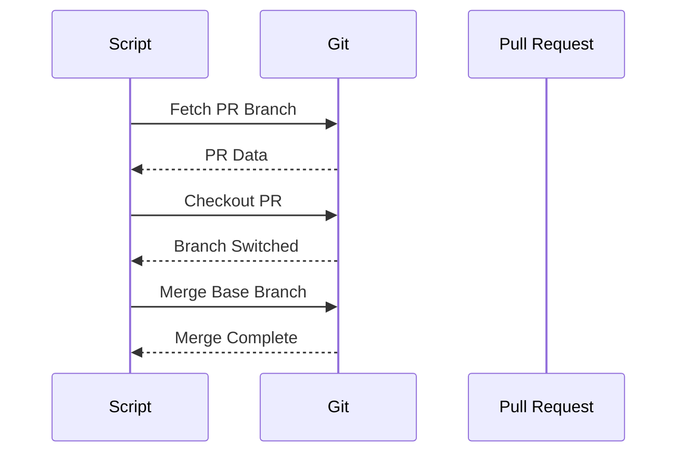
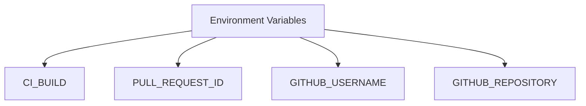
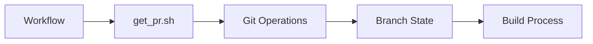
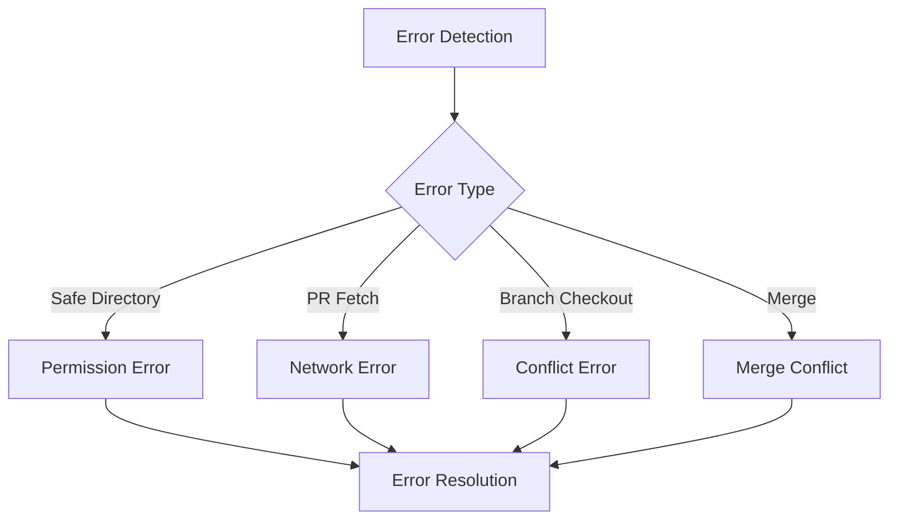

# get_pr.sh Documentation

## Overview
The `get_pr.sh` script is a critical component of the VSCodium build pipeline that handles pull request (PR) branch management and synchronization. It ensures proper branch context for PR-based builds and maintains repository state consistency.

## Table of Contents
- [Purpose](#purpose)
- [Script Analysis](#script-analysis)
- [Workflow Integration](#workflow-integration)
- [Error Handling](#error-handling)
- [Security Considerations](#security-considerations)
- [Best Practices](#best-practices)

## Purpose

The script serves two main purposes:
1. **CI Environment Setup**: Configures Git for safe directory access in CI environments
2. **PR Branch Management**: Handles PR branch checkout and synchronization



## Script Analysis

### 1. CI Environment Setup



#### Code Analysis
```bash
# git workaround
if [[ "${CI_BUILD}" != "no" ]]; then
  git config --global --add safe.directory "/__w/$( echo "${GITHUB_REPOSITORY}" | awk '{print tolower($0)}' )"
fi
```

- **Purpose**: Configures Git safe directory in CI environment
- **Components**:
  - CI_BUILD environment variable check
  - Safe directory configuration
  - Repository path normalization
- **Security**: Ensures secure repository access in CI

### 2. PR Branch Management



#### Code Analysis
```bash
if [[ -n "${PULL_REQUEST_ID}" ]]; then
  BRANCH_NAME=$( git rev-parse --abbrev-ref HEAD )

  git config --global user.email "$( echo "${GITHUB_USERNAME}" | awk '{print tolower($0)}' )-ci@not-real.com"
  git config --global user.name "${GITHUB_USERNAME} CI"
  git fetch --unshallow
  git fetch origin "pull/${PULL_REQUEST_ID}/head"
  git checkout FETCH_HEAD
  git merge --no-edit "origin/${BRANCH_NAME}"
fi
```

- **Purpose**: Manages PR branch checkout and synchronization
- **Components**:
  - PR ID validation
  - Git user configuration
  - PR branch fetching
  - Branch checkout
  - Base branch merge
- **Process Flow**:
  1. Check for PR ID
  2. Configure Git user
  3. Fetch PR branch
  4. Checkout PR
  5. Merge base branch

## Workflow Integration

### 1. Input Variables



- **CI_BUILD**: Controls CI-specific behavior
- **PULL_REQUEST_ID**: Identifies the PR to process
- **GITHUB_USERNAME**: Used for Git configuration
- **GITHUB_REPOSITORY**: Repository path for safe directory

### 2. Integration Points



- **Trigger**: PR-based workflow execution
- **Output**: Prepared branch state
- **Dependencies**: Git configuration
- **Next Steps**: Build process initiation

## Error Handling

### 1. Error Scenarios



### 2. Error Prevention
- Safe directory validation
- PR ID existence check
- Git configuration verification
- Branch state validation

## Security Considerations

### 1. Access Control
- Safe directory configuration
- Git user authentication
- Repository access validation

### 2. Data Protection
- Email address obfuscation
- Secure branch operations
- Controlled merge process

## Best Practices

### 1. Configuration
- Use environment variables
- Validate inputs
- Secure Git operations

### 2. Error Handling
- Early error detection
- Clear error messages
- Graceful failure handling

### 3. Performance
- Minimal Git operations
- Efficient branch management
- Optimized fetch strategy

## Common Issues and Solutions

### 1. Permission Issues
- **Problem**: Safe directory access denied
- **Solution**: Proper CI configuration

### 2. Merge Conflicts
- **Problem**: Branch merge failures
- **Solution**: Clean branch state

### 3. Network Issues
- **Problem**: PR fetch failures
- **Solution**: Retry mechanism

## Usage Examples

### 1. Basic Usage
```bash
export CI_BUILD=yes
export PULL_REQUEST_ID=123
./get_pr.sh
```

### 2. Custom Configuration
```bash
export GITHUB_USERNAME=custom-user
export GITHUB_REPOSITORY=owner/repo
./get_pr.sh
```

## Maintenance

### 1. Version Control
- Track script changes
- Document modifications
- Test updates

### 2. Testing
- CI environment testing
- PR scenario testing
- Error case testing

---

*This documentation provides a comprehensive overview of the get_pr.sh script, its functionality, and integration within the VSCodium build pipeline.* 