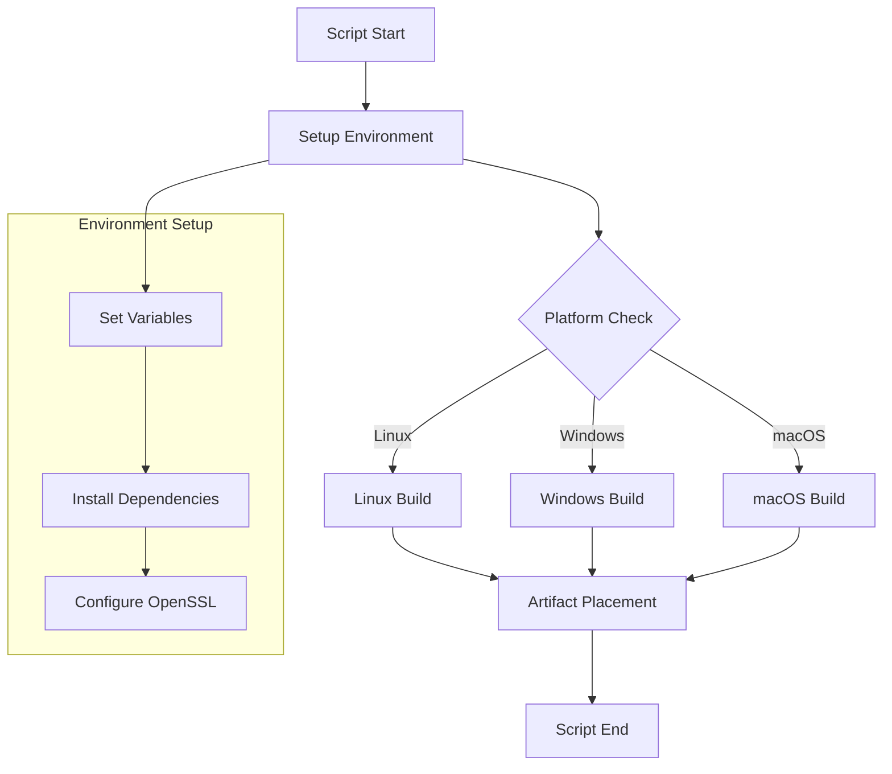
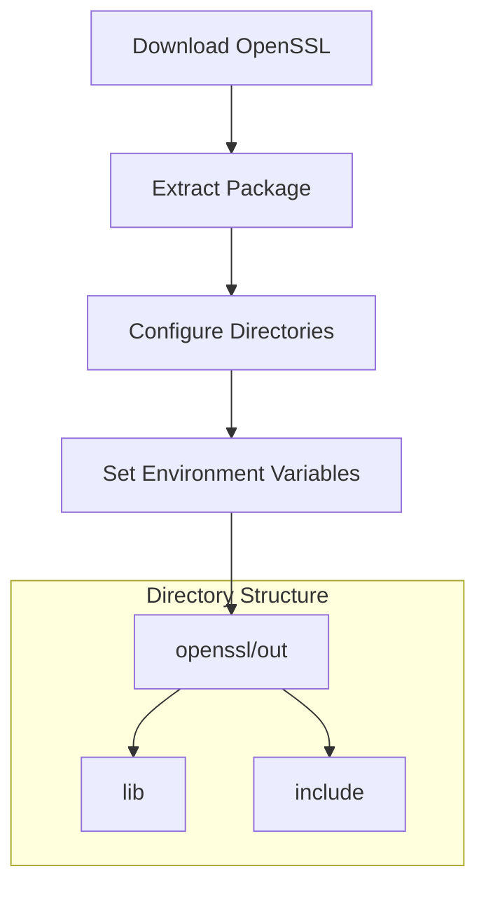
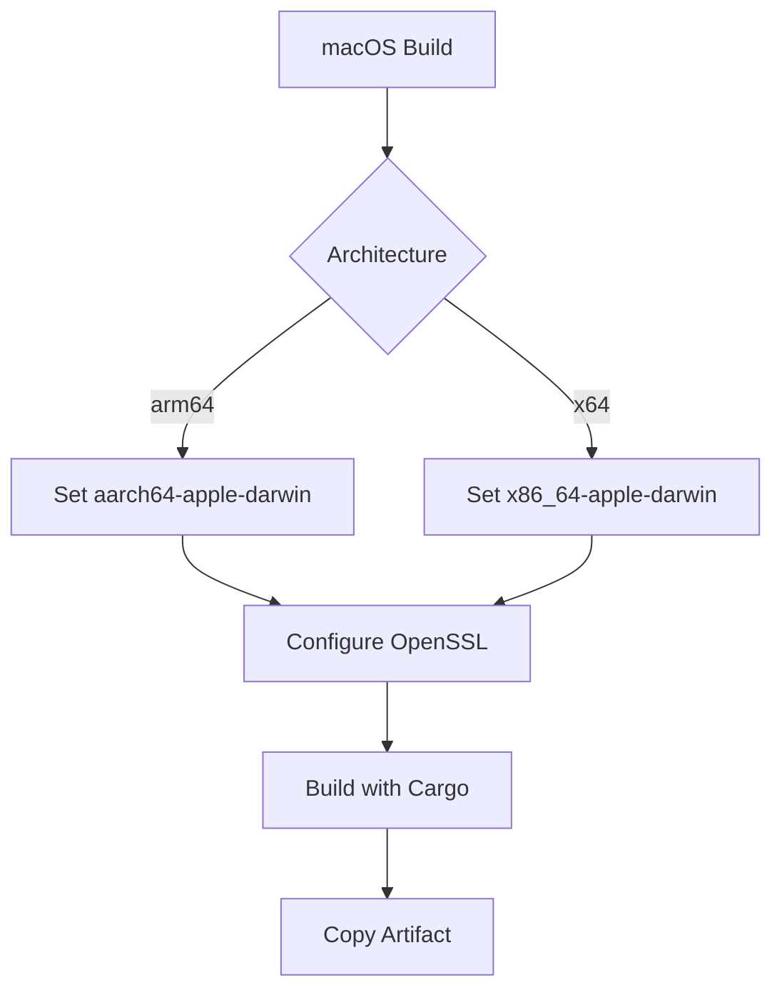
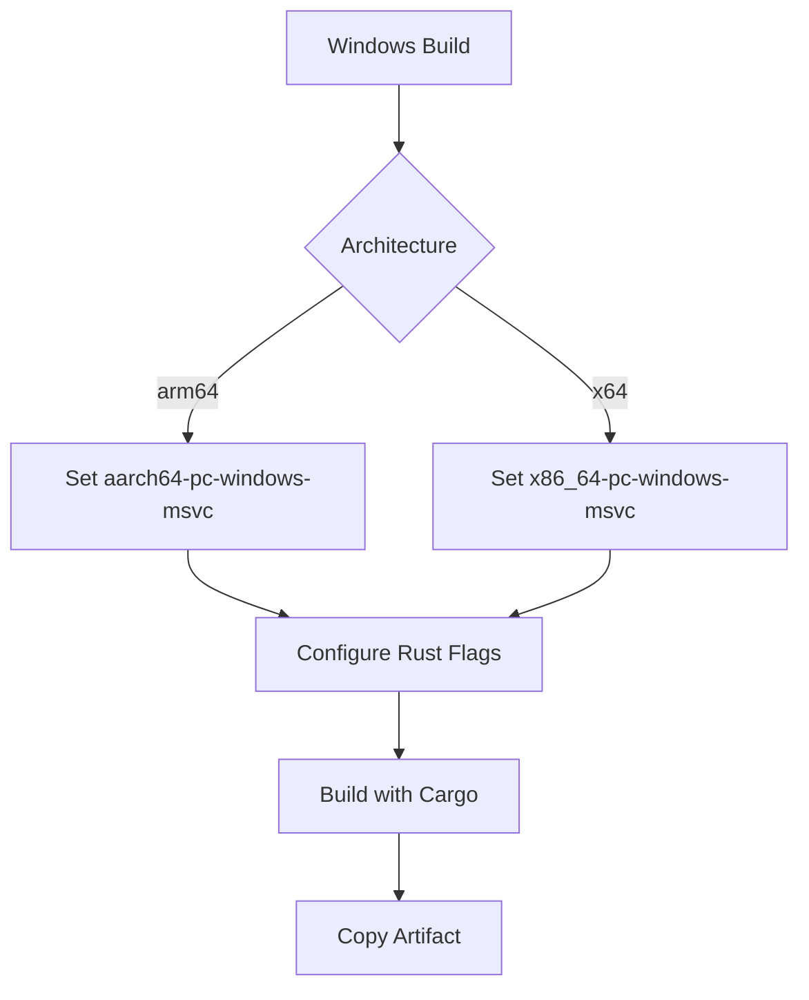
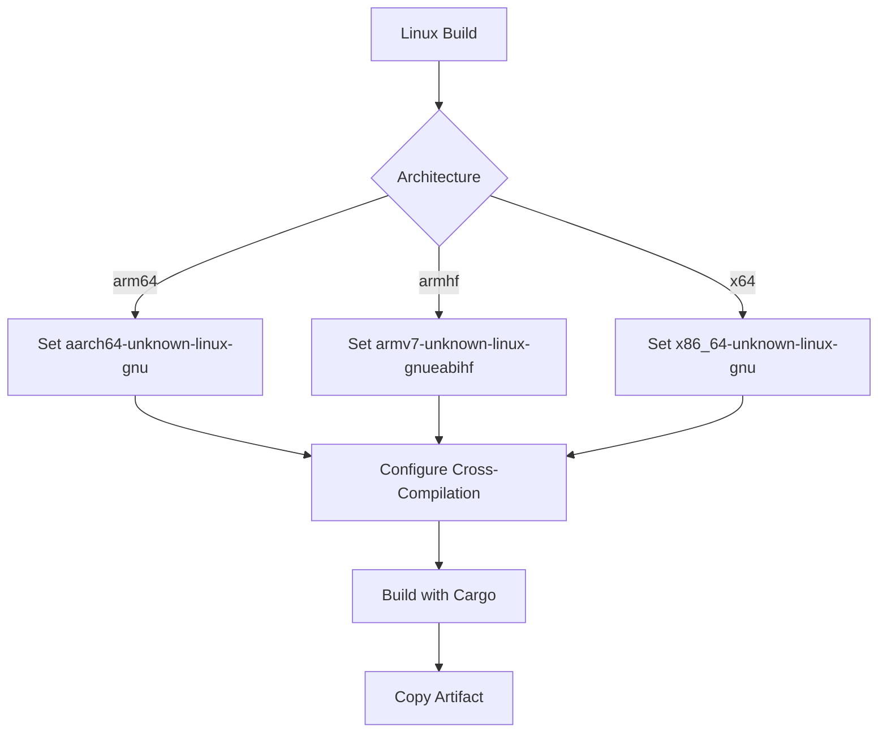
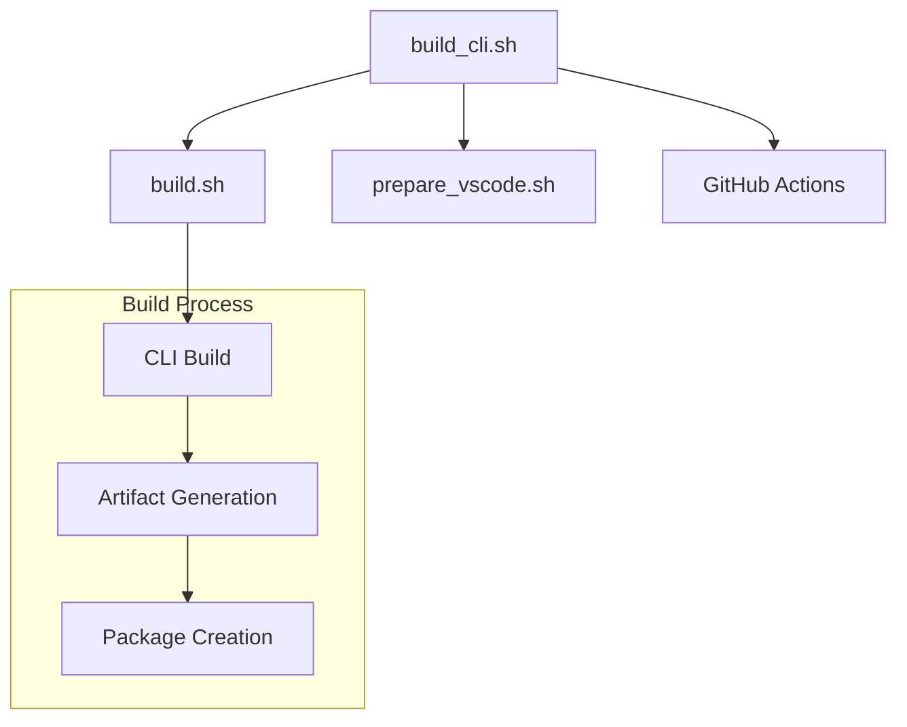

# VSCodium CLI Build Script Documentation

## Overview

The `build_cli.sh` script is a critical component of the VSCodium build system that handles the compilation and packaging of the VSCodium Command Line Interface (CLI) for different platforms and architectures. It manages cross-platform builds, dependencies, and environment configurations.

## Table of Contents
- [Purpose and Scope](#purpose-and-scope)
- [Script Configuration](#script-configuration)
- [Build Process](#build-process)
- [Platform-Specific Builds](#platform-specific-builds)
- [Dependency Management](#dependency-management)
- [Environment Setup](#environment-setup)
- [Error Handling](#error-handling)
- [Integration Points](#integration-points)
- [Security Considerations](#security-considerations)
- [Troubleshooting](#troubleshooting)

## Purpose and Scope

### Primary Objectives
1. Build VSCodium CLI for multiple platforms
2. Handle cross-platform dependencies
3. Manage build configurations
4. Ensure proper artifact placement

### Build Flow


## Script Configuration

### Basic Setup
```bash
#!/usr/bin/env bash

set -ex

cd cli

# Environment Variables
export CARGO_NET_GIT_FETCH_WITH_CLI="true"
export VSCODE_CLI_APP_NAME="$( echo "${APP_NAME}" | awk '{print tolower($0)}' )"
export VSCODE_CLI_BINARY_NAME="$( node -p "require(\"../product.json\").serverApplicationName" )"
export VSCODE_CLI_UPDATE_ENDPOINT="https://raw.githubusercontent.com/VSCodium/versions/refs/heads/master"
```

### Quality-Based Configuration
```bash
if [[ "${VSCODE_QUALITY}" == "insider" ]]; then
  export VSCODE_CLI_DOWNLOAD_ENDPOINT="https://github.com/VSCodium/vscodium-insiders/releases"
else
  export VSCODE_CLI_DOWNLOAD_ENDPOINT="https://github.com/VSCodium/vscodium/releases"
fi
```

## Build Process

### OpenSSL Setup


### Implementation Details
```bash
npm pack @vscode/openssl-prebuilt@0.0.11
mkdir openssl
tar -xvzf vscode-openssl-prebuilt-0.0.11.tgz --strip-components=1 --directory=openssl
```

## Platform-Specific Builds

### macOS Build


### Windows Build


### Linux Build


## Dependency Management

### Required Dependencies
1. **System Dependencies**
   - Rust toolchain
   - Node.js
   - OpenSSL
   - Platform-specific compilers

2. **Rust Dependencies**
   - Cargo
   - Target toolchains
   - Cross-compilation tools

### Environment Variables
```bash
# Common Variables
export OPENSSL_LIB_DIR="$( pwd )/openssl/out/${VSCODE_ARCH}-${OS_NAME}/lib"
export OPENSSL_INCLUDE_DIR="$( pwd )/openssl/out/${VSCODE_ARCH}-${OS_NAME}/include"

# Platform-Specific Variables
export VSCODE_CLI_RUSTFLAGS="-Ctarget-feature=+crt-static"
export VSCODE_CLI_CFLAGS="/guard:cf /Qspectre"
```

## Error Handling

### Common Issues
1. **Build Failures**
   - Missing dependencies
   - Compilation errors
   - Cross-compilation issues

2. **Environment Problems**
   - Variable conflicts
   - Path issues
   - Permission problems

### Error Recovery
```bash
# Check tool availability
if ! command -v cargo &> /dev/null; then
    echo "Error: Rust toolchain not found"
    exit 1
fi

# Verify OpenSSL setup
if [[ ! -d "${OPENSSL_LIB_DIR}" ]]; then
    echo "Error: OpenSSL libraries not found"
    exit 1
fi
```

## Integration Points

### Build System Integration


### Artifact Management
1. **Output Locations**
   - macOS: `VSCode-darwin-${VSCODE_ARCH}/${NAME_SHORT}.app/Contents/Resources/app/bin/`
   - Windows: `VSCode-win32-${VSCODE_ARCH}/bin/`
   - Linux: `VSCode-linux-${VSCODE_ARCH}/bin/`

2. **File Naming**
   - macOS: `${TUNNEL_APPLICATION_NAME}`
   - Windows: `${TUNNEL_APPLICATION_NAME}.exe`
   - Linux: `${TUNNEL_APPLICATION_NAME}`

## Security Considerations

### Build Security
1. **Compiler Flags**
   - Control Flow Guard (CFG)
   - Spectre mitigation
   - Static linking

2. **Dependency Security**
   - Version pinning
   - Checksum verification
   - Secure downloads

### Security Measures
```bash
# Secure build flags
export VSCODE_CLI_RUSTFLAGS="-Ctarget-feature=+crt-static -Clink-args=/guard:cf"
export VSCODE_CLI_CFLAGS="/guard:cf /Qspectre"

# Dependency verification
npm pack @vscode/openssl-prebuilt@0.0.11 --verify
```

## Troubleshooting

### Common Issues and Solutions

1. **Build Failures**
   ```bash
   # Check Rust installation
   rustc --version
   cargo --version
   
   # Verify target support
   rustup target list
   
   # Check OpenSSL setup
   ls -l "${OPENSSL_LIB_DIR}"
   ```

2. **Cross-Compilation Issues**
   ```bash
   # Verify cross-compiler
   ${CC} --version
   
   # Check sysroot
   ls -l "${VSCODE_SYSROOT_DIR}"
   
   # Test environment
   env | grep -E "CC|CXX|PKG_CONFIG"
   ```

3. **Artifact Problems**
   ```bash
   # Check file permissions
   ls -l "../../VSCode-${OS_NAME}-${VSCODE_ARCH}/bin/"
   
   # Verify binary
   file "../../VSCode-${OS_NAME}-${VSCODE_ARCH}/bin/${TUNNEL_APPLICATION_NAME}"
   
   # Test execution
   chmod +x "../../VSCode-${OS_NAME}-${VSCODE_ARCH}/bin/${TUNNEL_APPLICATION_NAME}"
   ```

### Debugging Tools
1. **Build Inspection**
   - Cargo build logs
   - Compiler output
   - Environment variables

2. **System Verification**
   - Toolchain versions
   - Library paths
   - Platform support

## Best Practices

### Build Management
1. **Consistency**
   - Standard build process
   - Consistent flags
   - Reliable artifact placement

2. **Documentation**
   - Build requirements
   - Platform support
   - Integration guidelines

### Maintenance
1. **Regular Updates**
   - Dependency updates
   - Security patches
   - Compatibility checks

2. **Testing**
   - Cross-platform tests
   - Integration tests
   - Security verification

---

*This documentation provides a comprehensive guide to the VSCodium CLI build script. For specific implementation details or updates, refer to the actual script file and related documentation.* 