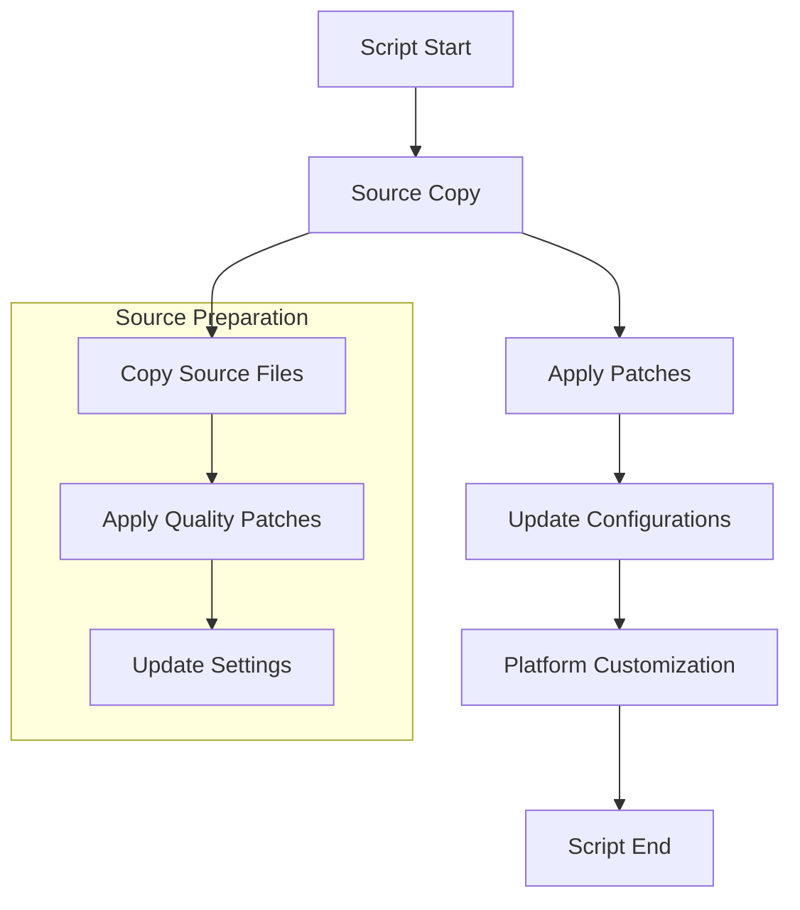
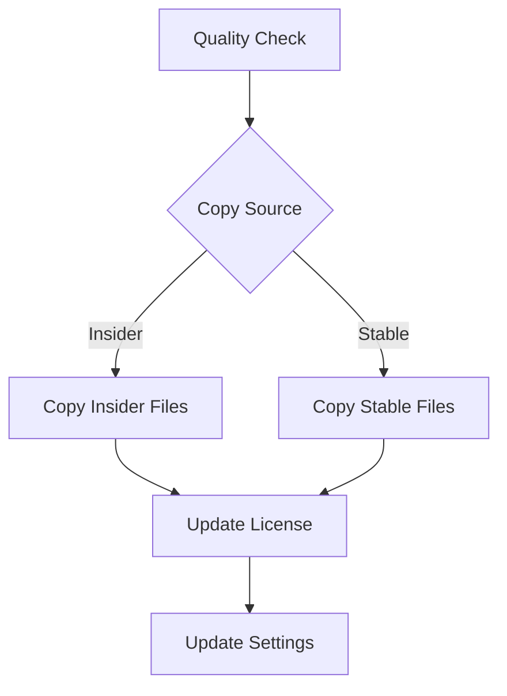
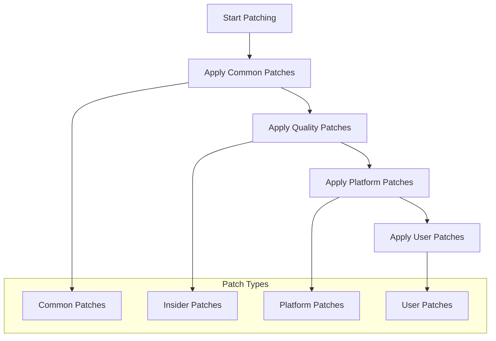
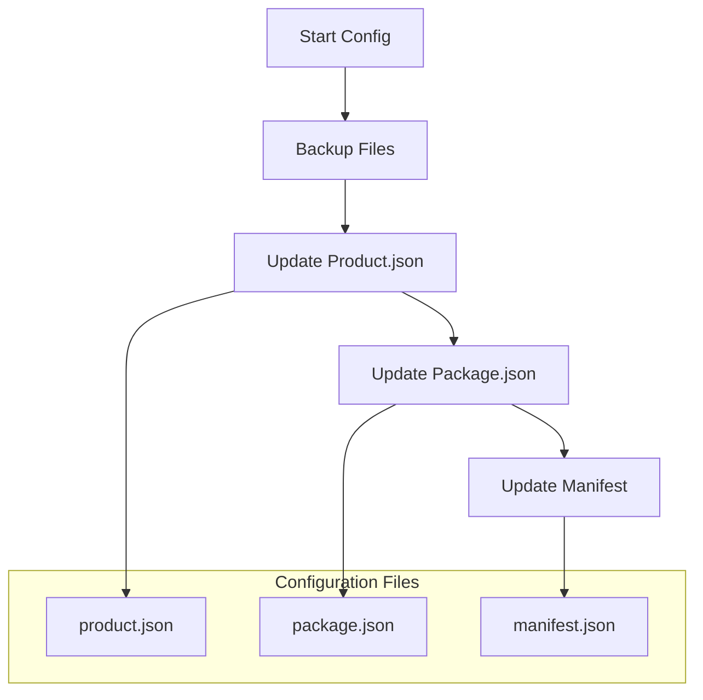
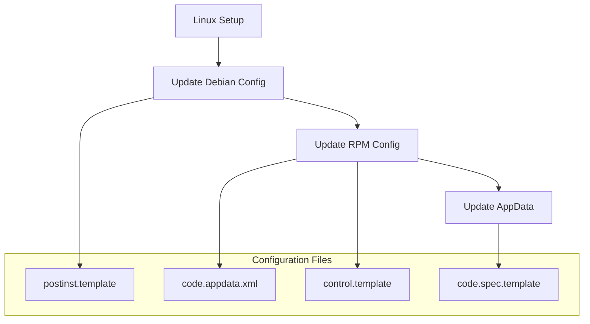
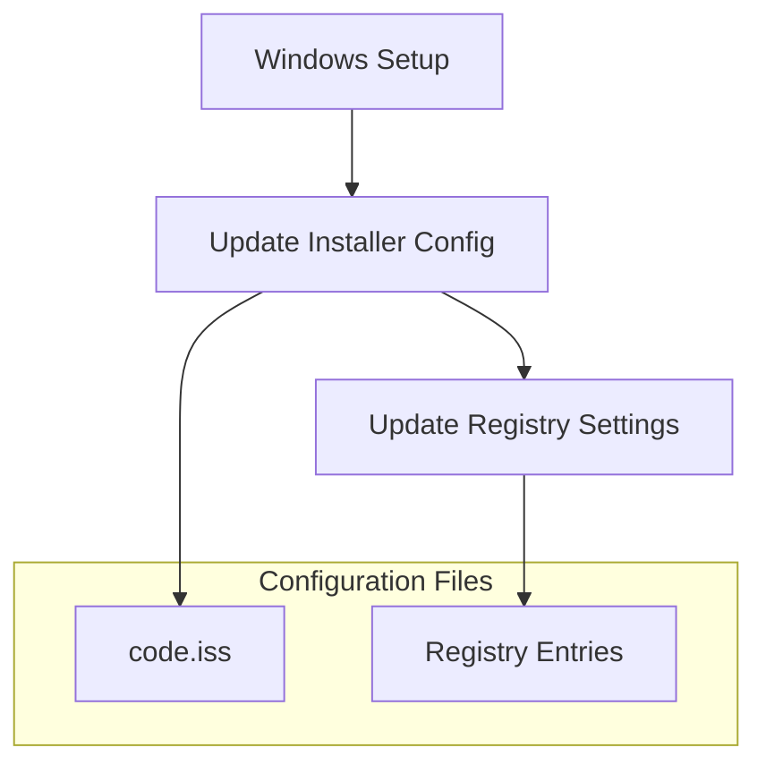
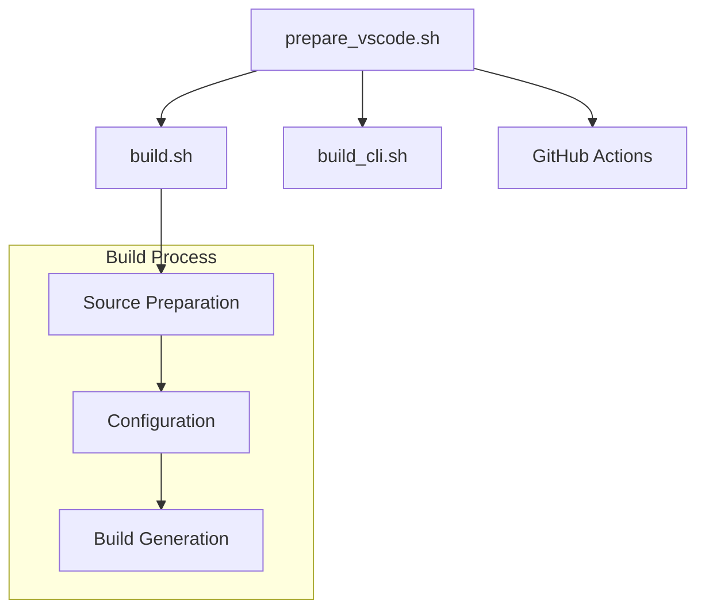

# VSCodium VSCode Preparation Script Documentation

## Overview

The `prepare_vscode.sh` script is a critical component of the VSCodium build system that handles the preparation and customization of the VSCode source code for VSCodium builds. It manages source code modifications, patches, and configuration settings to create a customized VSCodium version.

## Table of Contents
- [Purpose and Scope](#purpose-and-scope)
- [Script Configuration](#script-configuration)
- [Source Preparation](#source-preparation)
- [Patch Management](#patch-management)
- [Configuration Updates](#configuration-updates)
- [Platform-Specific Customizations](#platform-specific-customizations)
- [Error Handling](#error-handling)
- [Integration Points](#integration-points)
- [Security Considerations](#security-considerations)
- [Troubleshooting](#troubleshooting)

## Purpose and Scope

### Primary Objectives
1. Prepare VSCode source for VSCodium
2. Apply custom patches and modifications
3. Update configuration files
4. Handle platform-specific customizations

### Preparation Flow


## Script Configuration

### Basic Setup
```bash
#!/usr/bin/env bash
# shellcheck disable=SC1091,2154

set -e

# include common functions
. ./utils.sh
```

### Environment Variables
```bash
# Quality Settings
VSCODE_QUALITY="stable"  # or "insider"

# Application Settings
APP_NAME="VSCodium"
APP_NAME_LC="vscodium"
BINARY_NAME="codium"
GH_REPO_PATH="VSCodium/vscodium"
ORG_NAME="VSCodium"
```

## Source Preparation

### Source Copy Process


### Implementation Details
```bash
if [[ "${VSCODE_QUALITY}" == "insider" ]]; then
  cp -rp src/insider/* vscode/
else
  cp -rp src/stable/* vscode/
fi

cp -f LICENSE vscode/LICENSE.txt
```

## Patch Management

### Patch Application Flow


### Patch Implementation
```bash
# Apply common patches
for file in ../patches/*.patch; do
  if [[ -f "${file}" ]]; then
    apply_patch "${file}"
  fi
done

# Apply quality-specific patches
if [[ "${VSCODE_QUALITY}" == "insider" ]]; then
  for file in ../patches/insider/*.patch; do
    if [[ -f "${file}" ]]; then
      apply_patch "${file}"
    fi
  done
fi

# Apply platform-specific patches
if [[ -d "../patches/${OS_NAME}/" ]]; then
  for file in "../patches/${OS_NAME}/"*.patch; do
    if [[ -f "${file}" ]]; then
      apply_patch "${file}"
    fi
  done
fi
```

## Configuration Updates

### Product Configuration


### Configuration Changes
1. **Product Settings**
   - Update URLs and endpoints
   - Modify application names
   - Set quality-specific settings

2. **Package Settings**
   - Update version information
   - Modify package metadata
   - Set build configurations

## Platform-Specific Customizations

### Linux Customizations


### Windows Customizations


## Error Handling

### Common Issues
1. **Patch Application**
   - Failed patch application
   - Missing patch files
   - Incompatible patches

2. **Configuration Problems**
   - Invalid JSON
   - Missing files
   - Permission issues

### Error Recovery
```bash
# Check file existence
if [[ ! -d "vscode" ]]; then
    echo "'vscode' dir not found"
    exit 1
fi

# Verify patch application
if ! apply_patch "${file}"; then
    echo "Failed to apply patch: ${file}"
    exit 1
fi
```

## Integration Points

### Build System Integration


### Configuration Integration
1. **Build System**
   - Source code preparation
   - Configuration updates
   - Platform customization

2. **CI/CD Pipeline**
   - Quality-specific builds
   - Platform-specific builds
   - Automated testing

## Security Considerations

### Configuration Security
1. **File Integrity**
   - Backup verification
   - Checksum validation
   - Permission checks

2. **Content Security**
   - URL validation
   - Content verification
   - Secure updates

### Security Measures
```bash
# Secure file operations
cp -f LICENSE vscode/LICENSE.txt

# Backup important files
cp product.json{,.bak}
cp package.json{,.bak}
```

## Troubleshooting

### Common Issues and Solutions

1. **Patch Application**
   ```bash
   # Check patch files
   ls -l ../patches/*.patch
   
   # Verify patch content
   cat ../patches/*.patch
   
   # Test patch application
   patch --dry-run -p1 < ../patches/*.patch
   ```

2. **Configuration Problems**
   ```bash
   # Check JSON validity
   jq . product.json
   
   # Verify file permissions
   ls -l vscode/
   
   # Test configuration changes
   diff product.json product.json.bak
   ```

3. **Platform Issues**
   ```bash
   # Check platform-specific files
   ls -l "../patches/${OS_NAME}/"
   
   # Verify platform configuration
   cat "resources/${OS_NAME}/"*.template
   
   # Test platform customizations
   grep -r "VSCodium" "resources/${OS_NAME}/"
   ```

### Debugging Tools
1. **Configuration Inspection**
   - JSON validation
   - File comparison
   - Content verification

2. **System Verification**
   - File permissions
   - Directory structure
   - Platform support

## Best Practices

### Configuration Management
1. **Consistency**
   - Standard file formats
   - Consistent naming
   - Reliable backups

2. **Documentation**
   - Configuration changes
   - Platform support
   - Integration guidelines

### Maintenance
1. **Regular Updates**
   - Patch management
   - Configuration updates
   - Platform support

2. **Testing**
   - Configuration tests
   - Platform tests
   - Integration tests

---

*This documentation provides a comprehensive guide to the VSCodium VSCode preparation script. For specific implementation details or updates, refer to the actual script file and related documentation.* 