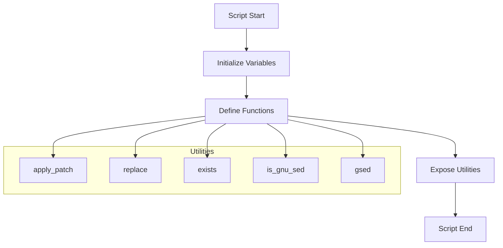
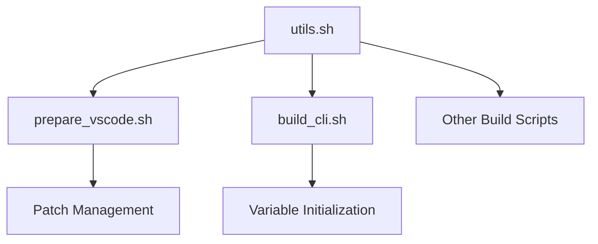

# VSCodium Utilities Script Documentation

## Overview

The `utils.sh` script provides a set of reusable utility functions and environment variable initializations used throughout the VSCodium build system. It standardizes common operations such as patch application, string replacement, and environment checks, ensuring consistency and maintainability across build scripts.

## Table of Contents
- [VSCodium Utilities Script Documentation](#vscodium-utilities-script-documentation)
  - [Overview](#overview)
  - [Table of Contents](#table-of-contents)
  - [Purpose and Scope](#purpose-and-scope)
    - [Primary Objectives](#primary-objectives)
    - [Utility Flow](#utility-flow)
  - [Environment Variables](#environment-variables)
  - [Function Reference](#function-reference)
    - [1. `apply_patch`](#1-apply_patch)
    - [2. `exists`](#2-exists)
    - [3. `is_gnu_sed`](#3-is_gnu_sed)
    - [4. `replace`](#4-replace)
    - [5. `gsed`](#5-gsed)
  - [Implementation Details](#implementation-details)
  - [Integration Points](#integration-points)
  - [Error Handling](#error-handling)
  - [Security Considerations](#security-considerations)
  - [Troubleshooting](#troubleshooting)
  - [Best Practices](#best-practices)

## Purpose and Scope

### Primary Objectives
1. Provide common utility functions for build scripts
2. Standardize patch application and string replacement
3. Initialize key environment variables
4. Enhance maintainability and reduce code duplication

### Utility Flow


## Environment Variables

| Variable      | Default Value         | Description                                 |
|--------------|----------------------|---------------------------------------------|
| APP_NAME     | VSCodium             | Application name                            |
| APP_NAME_LC  | vscodium             | Lowercase application name                  |
| BINARY_NAME  | codium               | Binary name                                 |
| GH_REPO_PATH | VSCodium/vscodium    | GitHub repository path                      |
| ORG_NAME     | VSCodium             | Organization name                           |

## Function Reference

### 1. `apply_patch`
**Purpose:** Applies a patch file to the source, performing variable substitution and error handling.

**Signature:**
```bash
apply_patch <patch_file>
```

**Key Steps:**
- Backs up the patch file
- Replaces template variables (e.g., `!!APP_NAME!!`)
- Applies the patch using `git apply`
- Restores the original patch file
- Exits on failure

**Example Usage:**
```bash
apply_patch "../patches/fix-bug.patch"
```

### 2. `exists`
**Purpose:** Checks if a command exists in the environment.

**Signature:**
```bash
exists <command>
```

**Example Usage:**
```bash
if exists jq; then
  echo "jq is available"
fi
```

### 3. `is_gnu_sed`
**Purpose:** Determines if the system `sed` is GNU sed.

**Signature:**
```bash
is_gnu_sed
```

**Example Usage:**
```bash
if is_gnu_sed; then
  echo "GNU sed detected"
fi
```

### 4. `replace`
**Purpose:** Performs in-place regex replacement in a file, handling both GNU and BSD sed.

**Signature:**
```bash
replace <sed_expression> <file>
```

**Example Usage:**
```bash
replace 's|foo|bar|g' myfile.txt
```

### 5. `gsed`
**Purpose:** Provides a GNU-compatible `sed` wrapper for systems where only BSD sed is available.

**Signature:**
```bash
gsed <sed_expression> <file>
```

**Example Usage:**
```bash
gsed 's|foo|bar|g' myfile.txt
```

## Implementation Details

- **Variable Initialization:** Ensures all key variables have defaults for consistent script behavior.
- **Patch Application:** Handles variable substitution and robust error handling for patching.
- **Cross-Platform Compatibility:** Adapts `sed` usage for both GNU and BSD environments.

## Integration Points



- Used by all major build scripts for patching and string replacement
- Centralizes utility logic for maintainability

## Error Handling

- Exits with error if patch application fails
- Handles missing commands gracefully
- Provides clear error messages for troubleshooting

## Security Considerations

- Ensures only intended files are modified
- Backs up files before modification
- Avoids code injection by using controlled variable substitution

## Troubleshooting

| Issue                        | Solution                                      |
|------------------------------|-----------------------------------------------|
| Patch fails to apply         | Check patch file syntax and target directory   |
| Variable not replaced        | Ensure variable is set before calling function |
| `sed` errors                 | Verify GNU vs BSD sed compatibility           |
| Command not found            | Install required command or check PATH         |

## Best Practices

- Always back up files before applying changes
- Use `apply_patch` for all patch operations
- Prefer `replace` and `gsed` for in-place editing
- Validate environment variables before use
- Keep utility functions up to date and documented

---

*This documentation provides a comprehensive guide to the VSCodium utilities script. For specific implementation details or updates, refer to the actual script file and related documentation.* 