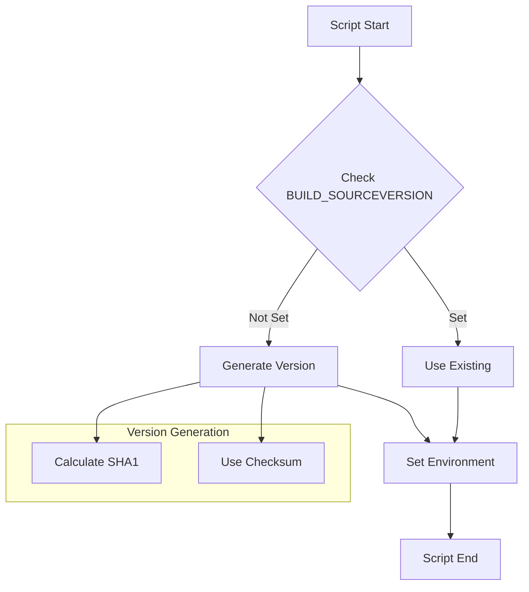
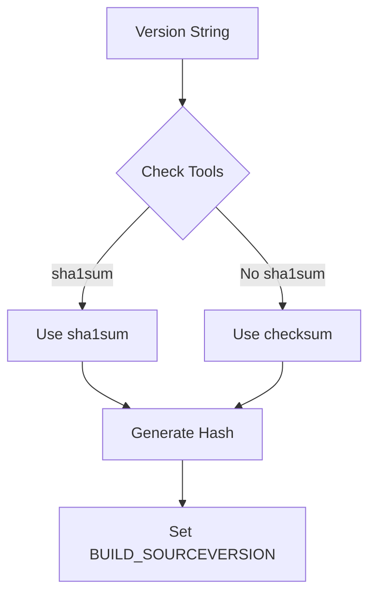
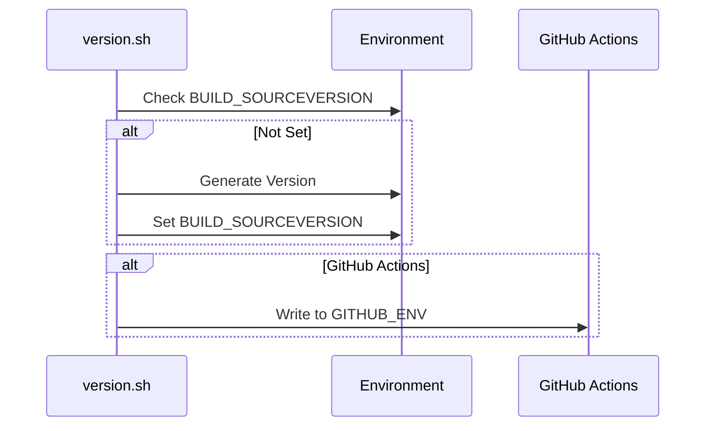
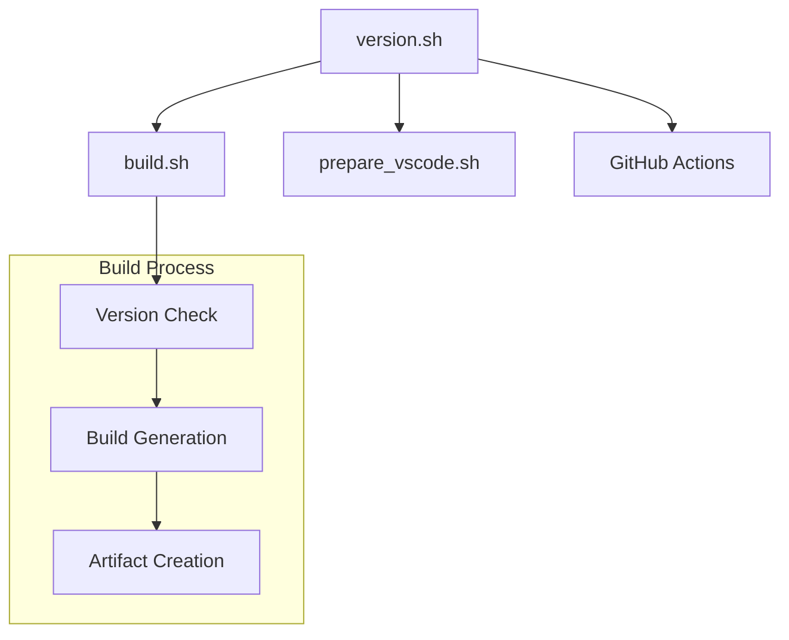

# VSCodium Version Script Documentation

## Overview

The `version.sh` script is a critical component of the VSCodium build system that manages version information and generates unique build identifiers. It ensures consistent version tracking across the build pipeline and handles version-related environment variables.

## Table of Contents
- [Purpose and Scope](#purpose-and-scope)
- [Script Configuration](#script-configuration)
- [Version Generation](#version-generation)
- [Environment Management](#environment-management)
- [Error Handling](#error-handling)
- [Integration Points](#integration-points)
- [Security Considerations](#security-considerations)
- [Troubleshooting](#troubleshooting)

## Purpose and Scope

### Primary Objectives
1. Generate unique build identifiers
2. Manage version information
3. Handle environment variables
4. Ensure version consistency

### Version Flow


## Script Configuration

### Basic Setup
```bash
#!/usr/bin/env bash

if [[ -z "${BUILD_SOURCEVERSION}" ]]; then
    # Version generation logic
fi

export BUILD_SOURCEVERSION
```

### Environment Variables
```bash
# Input Variables
RELEASE_VERSION="1.0.0"  # Example version
GITHUB_ENV="/path/to/github.env"  # GitHub Actions environment file

# Output Variables
BUILD_SOURCEVERSION="<generated_hash>"  # Generated version identifier
```

## Version Generation

### Hash Generation Methods


### Implementation Details
1. **SHA1 Method**
   ```bash
   if type -t "sha1sum" &> /dev/null; then
     BUILD_SOURCEVERSION=$( echo "${RELEASE_VERSION/-*/}" | sha1sum | cut -d' ' -f1 )
   fi
   ```

2. **Checksum Method**
   ```bash
   else
     npm install -g checksum
     BUILD_SOURCEVERSION=$( echo "${RELEASE_VERSION/-*/}" | checksum )
   fi
   ```

### Version Processing
1. **Input Processing**
   - Remove version suffixes (e.g., "-beta", "-rc")
   - Handle version string formatting
   - Validate version format

2. **Hash Generation**
   - Generate unique identifier
   - Ensure consistency
   - Handle different platforms

## Environment Management

### Variable Handling


### GitHub Actions Integration
```bash
if [[ "${GITHUB_ENV}" ]]; then
    echo "BUILD_SOURCEVERSION=${BUILD_SOURCEVERSION}" >> "${GITHUB_ENV}"
fi
```

## Error Handling

### Common Issues
1. **Version Generation**
   - Missing tools
   - Invalid version format
   - Permission issues

2. **Environment Problems**
   - Variable conflicts
   - File access issues
   - GitHub Actions integration

### Error Recovery
```bash
# Check tool availability
if ! type -t "sha1sum" &> /dev/null && ! type -t "npm" &> /dev/null; then
    echo "Error: No version generation tools available"
    exit 1
fi

# Validate version format
if [[ ! "${RELEASE_VERSION}" =~ ^[0-9]+\.[0-9]+\.[0-9]+ ]]; then
    echo "Error: Invalid version format"
    exit 1
fi
```

## Integration Points

### Build System Integration


### Version Usage
1. **Build Identification**
   - Unique build tracking
   - Artifact naming
   - Release management

2. **Environment Setup**
   - Build configuration
   - Toolchain setup
   - Dependency management

## Security Considerations

### Version Security
1. **Integrity Checks**
   - Version validation
   - Hash verification
   - Environment protection

2. **Access Control**
   - File permissions
   - Environment isolation
   - Secure tool usage

### Security Measures
```bash
# Secure version generation
if [[ -n "${BUILD_SOURCEVERSION}" ]]; then
    # Verify existing version
    if [[ ! "${BUILD_SOURCEVERSION}" =~ ^[a-f0-9]{40}$ ]]; then
        echo "Error: Invalid BUILD_SOURCEVERSION format"
        exit 1
    fi
fi
```

## Troubleshooting

### Common Issues and Solutions

1. **Version Generation Failures**
   ```bash
   # Check tool availability
   type -t "sha1sum"
   type -t "npm"
   
   # Verify version format
   echo "${RELEASE_VERSION}"
   
   # Check environment
   env | grep BUILD_SOURCEVERSION
   ```

2. **GitHub Actions Integration**
   ```bash
   # Verify GitHub environment
   echo "${GITHUB_ENV}"
   
   # Check file permissions
   ls -l "${GITHUB_ENV}"
   
   # Test environment writing
   echo "TEST=value" >> "${GITHUB_ENV}"
   ```

3. **Environment Issues**
   ```bash
   # Check variable scope
   declare -p BUILD_SOURCEVERSION
   
   # Verify export
   env | grep BUILD_SOURCEVERSION
   
   # Test variable usage
   echo "${BUILD_SOURCEVERSION}"
   ```

### Debugging Tools
1. **Version Inspection**
   - Version format validation
   - Hash generation verification
   - Environment checking

2. **System Verification**
   - Tool availability
   - File permissions
   - Environment setup

## Best Practices

### Version Management
1. **Consistency**
   - Standard version format
   - Consistent hash generation
   - Reliable environment handling

2. **Documentation**
   - Version format specification
   - Environment requirements
   - Integration guidelines

### Maintenance
1. **Regular Updates**
   - Tool version updates
   - Security patches
   - Compatibility checks

2. **Testing**
   - Version generation tests
   - Environment integration tests
   - Error handling tests

---

*This documentation provides a comprehensive guide to the VSCodium version script. For specific implementation details or updates, refer to the actual script file and related documentation.* 