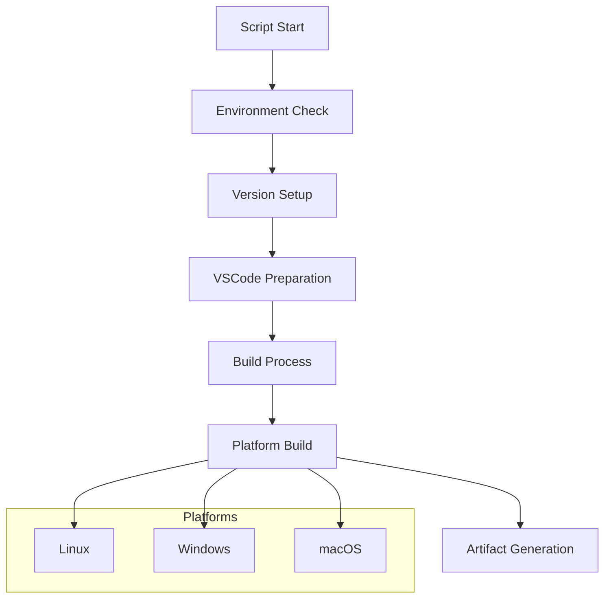
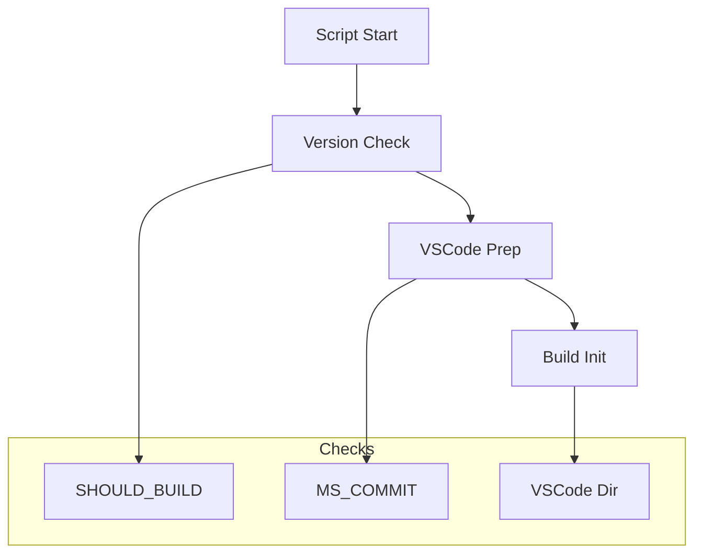
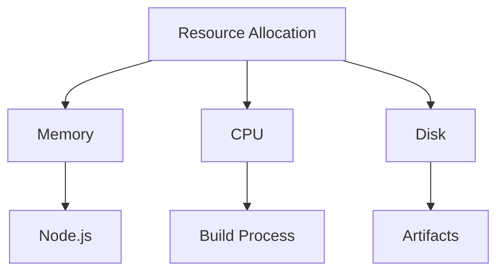
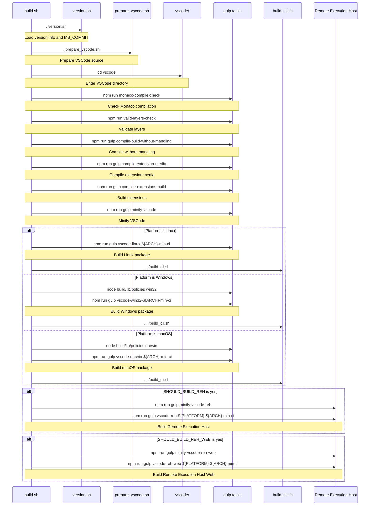
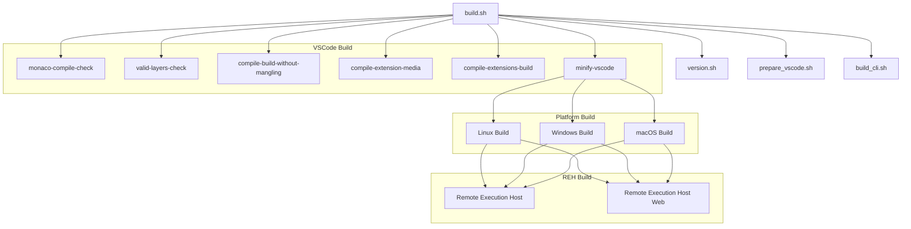

# VSCodium Build Script Documentation

## Overview

The `build.sh` script is the core build driver for VSCodium, responsible for orchestrating the compilation and packaging process across different platforms. It handles platform-specific build configurations, manages build artifacts, and ensures consistent build quality.

## Table of Contents
- [Purpose and Scope](#purpose-and-scope)
- [Script Configuration](#script-configuration)
- [Execution Flow](#execution-flow)
- [Platform-Specific Builds](#platform-specific-builds)
- [Build Artifacts](#build-artifacts)
- [Error Handling](#error-handling)
- [Performance Considerations](#performance-considerations)
- [Security Measures](#security-measures)
- [Troubleshooting](#troubleshooting)

## Purpose and Scope

### Primary Objectives
1. Manage cross-platform build process
2. Handle platform-specific configurations
3. Generate build artifacts
4. Ensure build consistency

### Build Flow


## Script Configuration

### Basic Setup
```bash
#!/usr/bin/env bash
# shellcheck disable=SC1091

set -ex

. version.sh
```

### Environment Variables
```bash
# Build Control
SHOULD_BUILD="yes"
SHOULD_BUILD_REH="no"
SHOULD_BUILD_REH_WEB="no"

# Platform Configuration
OS_NAME="linux"  # or "windows" or "osx"
VSCODE_ARCH="x64"  # or "arm64", "armhf", etc.
VSCODE_PLATFORM="linux"  # or "win32" or "darwin"

# CI Configuration
CI_BUILD="no"
```

## Execution Flow

### Initial Setup


### Build Process
1. **Version Setup**
   ```bash
   . version.sh
   echo "MS_COMMIT=\"${MS_COMMIT}\""
   ```

2. **VSCode Preparation**
   ```bash
   . prepare_vscode.sh
   cd vscode || { echo "'vscode' dir not found"; exit 1; }
   ```

3. **Node Configuration**
   ```bash
   export NODE_OPTIONS="--max-old-space-size=8192"
   ```

## Platform-Specific Builds

### Linux Build
```bash
if [[ "${OS_NAME}" == "linux" ]]; then
  npm run gulp "vscode-linux-${VSCODE_ARCH}-min-ci"
  find "../VSCode-linux-${VSCODE_ARCH}" -print0 | xargs -0 touch -c
  . ../build_cli.sh
  VSCODE_PLATFORM="linux"
fi
```

### Windows Build
```bash
if [[ "${OS_NAME}" == "windows" ]]; then
  node build/lib/policies win32
  npm run gulp "vscode-win32-${VSCODE_ARCH}-min-ci"
  if [[ "${VSCODE_ARCH}" != "x64" ]]; then
    SHOULD_BUILD_REH="no"
    SHOULD_BUILD_REH_WEB="no"
  fi
  . ../build_cli.sh
  VSCODE_PLATFORM="win32"
fi
```

### macOS Build
```bash
if [[ "${OS_NAME}" == "osx" ]]; then
  node build/lib/policies darwin
  npm run gulp "vscode-darwin-${VSCODE_ARCH}-min-ci"
  find "../VSCode-darwin-${VSCODE_ARCH}" -print0 | xargs -0 touch -c
  . ../build_cli.sh
  VSCODE_PLATFORM="darwin"
fi
```

## Build Artifacts

### Common Build Steps
```bash
npm run monaco-compile-check
npm run valid-layers-check
npm run gulp compile-build-without-mangling
npm run gulp compile-extension-media
npm run gulp compile-extensions-build
npm run gulp minify-vscode
```

### Remote Execution Host (REH)
```bash
if [[ "${SHOULD_BUILD_REH}" != "no" ]]; then
  npm run gulp minify-vscode-reh
  npm run gulp "vscode-reh-${VSCODE_PLATFORM}-${VSCODE_ARCH}-min-ci"
fi
```

### Remote Execution Host Web
```bash
if [[ "${SHOULD_BUILD_REH_WEB}" != "no" ]]; then
  npm run gulp minify-vscode-reh-web
  npm run gulp "vscode-reh-web-${VSCODE_PLATFORM}-${VSCODE_ARCH}-min-ci"
fi
```

## Error Handling

### Common Issues
1. **Build Failures**
   - Missing dependencies
   - Version conflicts
   - Resource limitations

2. **Platform-Specific Issues**
   - Architecture mismatches
   - Toolchain problems
   - Permission issues

### Error Recovery
```bash
# Check build logs
cat build.log

# Verify Node.js memory
echo $NODE_OPTIONS

# Check platform configuration
echo "OS: ${OS_NAME}"
echo "Arch: ${VSCODE_ARCH}"
```

## Performance Considerations

### Optimization Strategies
1. **Memory Management**
   - Node.js memory limits
   - Resource allocation
   - Cache utilization

2. **Build Optimization**
   - Parallel processing
   - Incremental builds
   - Artifact caching

### Resource Management


## Security Measures

### Build Security
1. **Environment Isolation**
   - Clean build environment
   - Controlled dependencies
   - Secure toolchain

2. **Artifact Verification**
   - Checksum validation
   - Binary verification
   - Resource validation

### Security Checks
```bash
# Verify build environment
env | grep -i "vscode\|node"

# Check file permissions
find . -type f -exec ls -l {} \;

# Validate dependencies
npm audit
```

## Troubleshooting

### Common Issues and Solutions

1. **Build Failures**
   ```bash
   # Check Node.js version
   node --version
   
   # Verify npm packages
   npm list --depth=0
   
   # Check build logs
   cat build.log
   ```

2. **Memory Issues**
   ```bash
   # Check available memory
   free -h
   
   # Adjust Node.js memory
   export NODE_OPTIONS="--max-old-space-size=16384"
   ```

3. **Platform-Specific Problems**
   ```bash
   # Verify platform configuration
   echo "OS: ${OS_NAME}"
   echo "Arch: ${VSCODE_ARCH}"
   
   # Check toolchain
   gcc --version
   node --version
   ```

### Debugging Tools
1. **Build Inspection**
   - Build logs
   - Error messages
   - Performance metrics

2. **Environment Verification**
   - Platform checks
   - Dependency validation
   - Resource monitoring

## Best Practices

### Build Management
1. **Version Control**
   - Consistent versioning
   - Changelog maintenance
   - Release tracking

2. **Quality Assurance**
   - Automated testing
   - Build verification
   - Artifact validation

### Maintenance
1. **Regular Updates**
   - Dependency updates
   - Security patches
   - Performance improvements

2. **Documentation**
   - Build instructions
   - Troubleshooting guides
   - Release notes

## Script Execution Flow

### Sequential Execution Diagram


### Script Dependencies


### Execution Order
1. **Initialization**
   - Load version.sh
   - Load prepare_vscode.sh
   - Set up environment

2. **Core Build Steps**
   - Monaco compilation check
   - Layer validation
   - Build compilation
   - Extension media compilation
   - Extensions build
   - VSCode minification

3. **Platform-Specific Build**
   - Linux build
   - Windows build
   - macOS build

4. **Remote Execution Host**
   - REH build (if enabled)
   - REH Web build (if enabled)

5. **Finalization**
   - CLI build
   - Artifact generation
   - Cleanup

---

*This documentation provides a comprehensive guide to the VSCodium build script. For specific implementation details or updates, refer to the actual script file and related documentation.* 