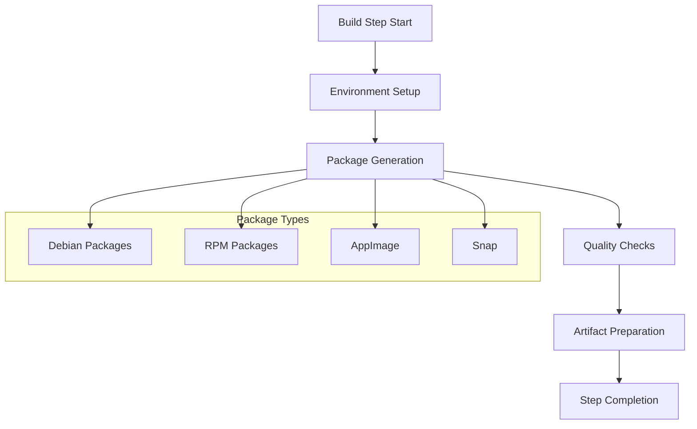
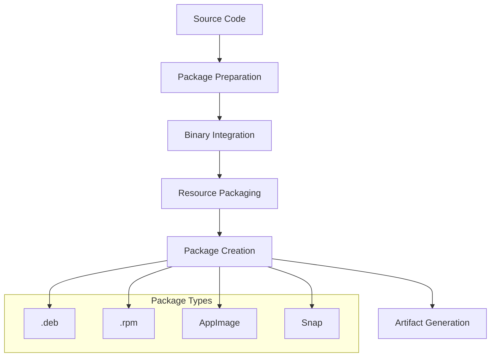
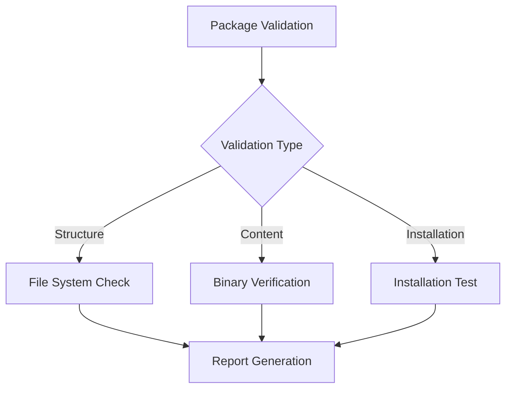
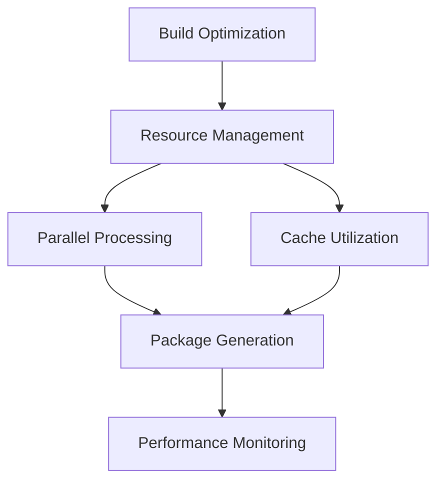

# VSCodium Linux Build Step Documentation

## Overview

The Build Step is a crucial phase in the VSCodium Linux build pipeline that follows the compilation process. This step is responsible for packaging the compiled code into distributable formats and preparing it for deployment.

## Table of Contents
- [Purpose and Scope](#purpose-and-scope)
- [Build Configuration](#build-configuration)
- [Environment Setup](#environment-setup)
- [Build Process](#build-process)
- [Package Generation](#package-generation)
- [Quality Assurance](#quality-assurance)
- [Error Handling](#error-handling)
- [Performance Optimization](#performance-optimization)
- [Security Considerations](#security-considerations)
- [Troubleshooting](#troubleshooting)

## Purpose and Scope

### Primary Objectives
1. Package compiled code into distributable formats
2. Generate platform-specific packages
3. Ensure build quality and consistency
4. Prepare artifacts for deployment

### Build Flow


## Build Configuration

### Basic Configuration
```yaml
- name: Build
  env:
    SHOULD_BUILD_REH: 'no'
    SHOULD_BUILD_REH_WEB: 'no'
  run: ./build.sh
  if: env.SHOULD_BUILD == 'yes'
```

### Environment Variables
```yaml
env:
  # Build Control
  SHOULD_BUILD: 'yes'
  SHOULD_BUILD_REH: 'no'
  SHOULD_BUILD_REH_WEB: 'no'
  
  # Package Configuration
  APP_NAME: VSCodium
  BINARY_NAME: codium
  OS_NAME: linux
  VSCODE_QUALITY: stable
```

## Environment Setup

### Required Tools
1. **Build Tools**
   - dpkg-deb: For Debian package creation
   - rpmbuild: For RPM package creation
   - appimagetool: For AppImage generation
   - snapcraft: For Snap package creation

2. **Dependencies**
   - fakeroot: For package building
   - rpm: For RPM package support
   - desktop-file-utils: For desktop integration
   - libsecret-1-dev: For credential storage

### Tool Installation
```bash
# Debian/Ubuntu
sudo apt-get update
sudo apt-get install -y \
    fakeroot \
    rpm \
    desktop-file-utils \
    libsecret-1-dev

# AppImage tools
wget https://github.com/AppImage/AppImageKit/releases/download/continuous/appimagetool-x86_64.AppImage
chmod +x appimagetool-x86_64.AppImage
```

## Build Process

### Package Generation Flow


### Build Steps
1. **Package Preparation**
   - Create package structure
   - Set up control files
   - Configure package metadata

2. **Binary Integration**
   - Copy compiled binaries
   - Set executable permissions
   - Configure runtime paths

3. **Resource Packaging**
   - Package icons and resources
   - Include documentation
   - Add desktop integration

4. **Package Creation**
   - Generate package files
   - Sign packages
   - Create checksums

## Package Generation

### Debian Package (.deb)
```bash
# Package structure
/usr/bin/codium
/usr/share/applications/codium.desktop
/usr/share/icons/hicolor/...
/usr/share/doc/codium/
```

### RPM Package (.rpm)
```bash
# Package structure
/usr/bin/codium
/usr/share/applications/codium.desktop
/usr/share/icons/hicolor/...
/usr/share/doc/codium/
```

### AppImage
```bash
# AppImage structure
AppDir/
  usr/
    bin/
    share/
  AppRun
  .DirIcon
  codium.desktop
```

### Snap Package
```yaml
# snapcraft.yaml
name: codium
version: '1.0.0'
summary: VSCodium - Open Source Binaries of VSCode
description: |
  VSCodium is a community-driven, freely-licensed binary distribution of Microsoft's editor VSCode
```

## Quality Assurance

### Package Validation
1. **Structure Verification**
   - Check file permissions
   - Verify package hierarchy
   - Validate desktop integration

2. **Content Validation**
   - Verify binary integrity
   - Check resource completeness
   - Validate documentation

3. **Installation Testing**
   - Test package installation
   - Verify desktop integration
   - Check application launch

### Quality Checks


## Error Handling

### Common Issues
1. **Package Generation Errors**
   - Missing dependencies
   - Permission issues
   - Resource conflicts

2. **Validation Failures**
   - Structure violations
   - Content errors
   - Installation problems

### Error Recovery
```bash
# Check package structure
dpkg-deb -c package.deb

# Verify package contents
rpm -qlp package.rpm

# Test installation
sudo dpkg -i package.deb
sudo rpm -i package.rpm
```

## Performance Optimization

### Build Optimization
1. **Parallel Processing**
   - Concurrent package generation
   - Parallel validation
   - Multi-threaded compression

2. **Resource Management**
   - Efficient disk usage
   - Memory optimization
   - Cache utilization

### Optimization Strategies


## Security Considerations

### Package Security
1. **Integrity Verification**
   - Package signing
   - Checksum validation
   - Binary verification

2. **Content Security**
   - Resource validation
   - Permission checks
   - Dependency verification

### Security Measures
```bash
# Generate checksums
sha256sum package.deb > package.deb.sha256

# Verify package signature
gpg --verify package.deb.asc package.deb

# Check file permissions
find /usr/bin/codium -type f -exec ls -l {} \;
```

## Troubleshooting

### Common Issues and Solutions

1. **Package Generation Failures**
   ```bash
   # Check build logs
   cat build.log
   
   # Verify package structure
   dpkg-deb -c package.deb
   
   # Check dependencies
   dpkg -I package.deb
   ```

2. **Installation Problems**
   ```bash
   # Check system requirements
   cat /etc/os-release
   
   # Verify package dependencies
   apt-cache depends package.deb
   
   # Check installation logs
   cat /var/log/dpkg.log
   ```

3. **Runtime Issues**
   ```bash
   # Check application logs
   cat ~/.config/VSCodium/logs/main.log
   
   # Verify desktop integration
   xdg-desktop-menu validate codium.desktop
   
   # Check binary execution
   strace codium
   ```

### Debugging Tools
1. **Package Inspection**
   - dpkg-deb
   - rpm
   - appimagetool

2. **System Monitoring**
   - strace
   - lsof
   - systemd-analyze

## Best Practices

### Package Management
1. **Version Control**
   - Semantic versioning
   - Changelog maintenance
   - Release notes

2. **Quality Assurance**
   - Automated testing
   - Manual verification
   - User feedback

### Maintenance
1. **Regular Updates**
   - Dependency updates
   - Security patches
   - Feature additions

2. **Documentation**
   - Installation guides
   - Troubleshooting docs
   - Release notes

---

*This documentation provides a comprehensive guide to the VSCodium Linux Build Step. For specific implementation details or updates, refer to the actual workflow file and related documentation.*