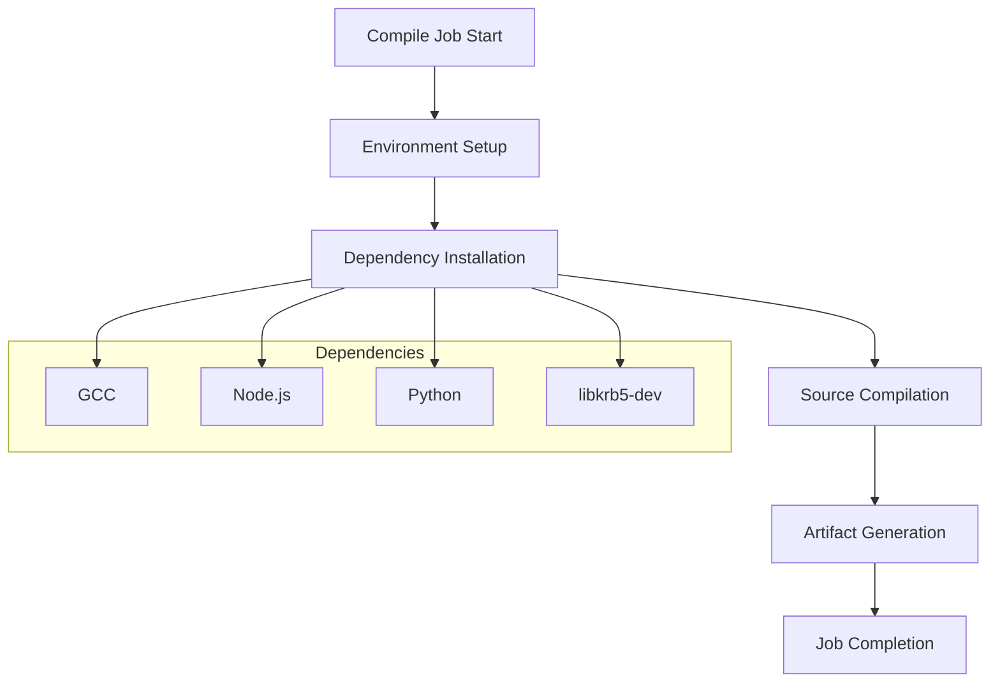
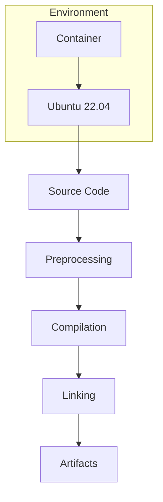
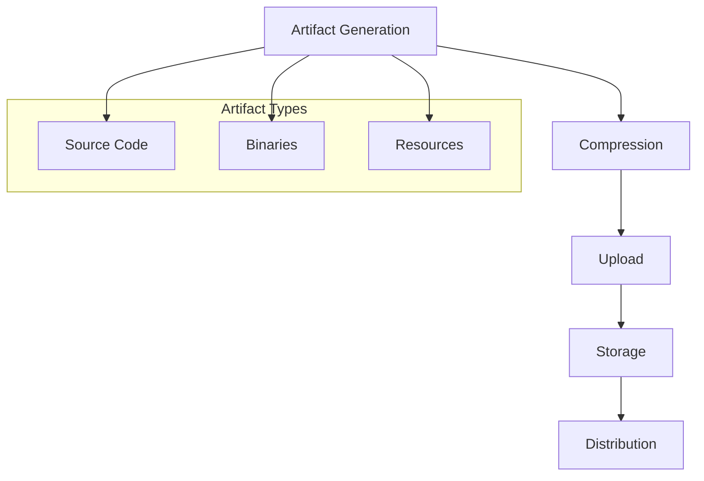
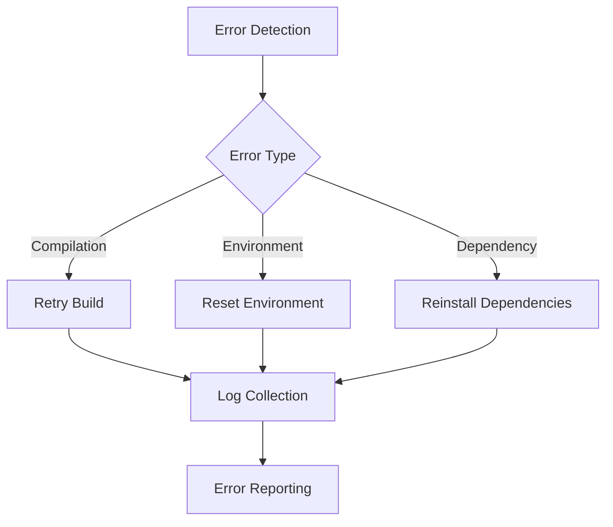
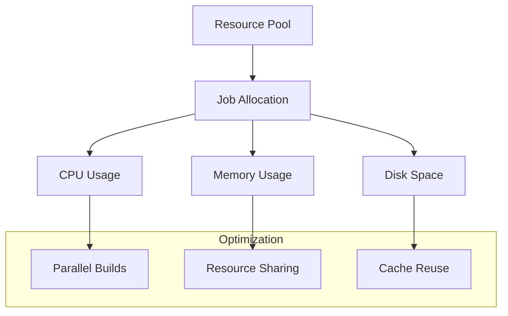

# VSCodium Linux Compile Job Documentation

## Overview

The Compile Job is a critical component of the VSCodium Linux build pipeline, responsible for the initial compilation of the VSCode source code. This job sets up the necessary build environment, compiles the source code, and generates artifacts that are used by subsequent build jobs.

## Table of Contents
- [Purpose and Scope](#purpose-and-scope)
- [Job Configuration](#job-configuration)
- [Environment Setup](#environment-setup)
- [Compilation Process](#compilation-process)
- [Artifact Generation](#artifact-generation)
- [Error Handling](#error-handling)
- [Performance Considerations](#performance-considerations)
- [Security Measures](#security-measures)
- [Troubleshooting](#troubleshooting)

## Purpose and Scope

### Primary Objectives
1. Set up the build environment with required dependencies
2. Compile the VSCode source code
3. Generate and package compilation artifacts
4. Ensure build consistency across different architectures

### Job Flow


## Job Configuration

### Basic Configuration
```yaml
compile:
  name: Compile
  runs-on: ubuntu-22.04
  needs: check
  if: needs.check.outputs.SHOULD_BUILD == 'yes' || github.event.inputs.generate_assets == 'true'
```

### Dependencies
```yaml
steps:
  - name: Setup GCC
    uses: egor-tensin/setup-gcc@v1
  - name: Setup Node.js environment
    uses: actions/setup-node@v4
  - name: Setup Python 3
    uses: actions/setup-python@v5
  - name: Install libkrb5-dev
    run: sudo apt-get update -y && sudo apt-get install -y libkrb5-dev
```

## Environment Setup

### Required Tools
1. **GCC Compiler**
   - Version: Latest stable
   - Purpose: C/C++ compilation
   - Setup: Using egor-tensin/setup-gcc@v1

2. **Node.js**
   - Version: Latest LTS
   - Purpose: JavaScript compilation and package management
   - Setup: Using actions/setup-node@v4

3. **Python**
   - Version: 3.x
   - Purpose: Build scripts and utilities
   - Setup: Using actions/setup-python@v5

4. **System Libraries**
   - libkrb5-dev: Required for authentication features
   - Other dependencies as specified in package.json

### Environment Variables
```yaml
env:
  GITHUB_TOKEN: ${{ secrets.GITHUB_TOKEN }}
  npm_config_arch: x64
```

## Compilation Process

### Source Code Preparation


### Build Steps
1. **Source Code Checkout**
   - Clones the VSCode repository
   - Checks out the specified commit/tag

2. **Dependency Installation**
   - Installs Node.js dependencies
   - Sets up Python environment
   - Configures system libraries

3. **Compilation**
   - Compiles TypeScript/JavaScript code
   - Builds native modules
   - Generates binary artifacts

4. **Testing**
   - Runs unit tests
   - Performs basic functionality checks

## Artifact Generation

### Artifact Types
1. **Source Code Archive**
   ```bash
   find vscode -type f -not -path "*/node_modules/*" > vscode.txt
   tar -czf vscode.tar.gz -T vscode.txt
   ```

2. **Binary Artifacts**
   - Compiled JavaScript files
   - Native modules
   - Resource files

### Artifact Compression and Upload

After the compilation and build steps, the pipeline compresses the `vscode` directory into a tarball and uploads it as a build artifact. This ensures that only the necessary files are included and that the artifact is available for subsequent jobs or for download.

#### Compression Step
The following step in the workflow finds all relevant files in the `vscode` directory (excluding `node_modules`, `.build/node`, and `.git` directories), adds a few specific paths, and creates a compressed archive:

```yaml
- name: Compress vscode artifact
  run: |
    find vscode -type f -not -path "*/node_modules/*" -not -path "vscode/.build/node/*" -not -path "vscode/.git/*" > vscode.txt
    echo "vscode/.build/extensions/node_modules" >> vscode.txt
    echo "vscode/.git" >> vscode.txt
    tar -czf vscode.tar.gz -T vscode.txt
  if: env.SHOULD_BUILD == 'yes'
```
- **Purpose:**
  - Excludes unnecessary files to reduce artifact size.
  - Ensures important directories are included.
  - Produces a `vscode.tar.gz` archive for portability and efficiency.

#### Upload Step
The next step uploads the compressed artifact using the GitHub Actions `upload-artifact` action:

```yaml
- name: Upload vscode artifact
  uses: actions/upload-artifact@v4
  with:
    name: vscode
    path: ./vscode.tar.gz
    retention-days: ${{ needs.check.outputs.SHOULD_DEPLOY == 'yes' && 30 || 1 }}
  if: env.SHOULD_BUILD == 'yes'
```
- **Purpose:**
  - Makes the artifact available for later jobs or manual download.
  - Sets retention based on deployment needs (30 days if deploying, otherwise 1 day).

### Artifact Management


- **Compression**: Reduces size and ensures only necessary files are included.
- **Upload**: Ensures artifacts are accessible for downstream jobs and for auditing or debugging purposes.

---

*This section now fully documents the compression and upload of the vscode artifact as implemented in the workflow.*

## Error Handling

### Common Issues
1. **Compilation Errors**
   - Missing dependencies
   - Version conflicts
   - Build configuration issues

2. **Environment Issues**
   - Insufficient permissions
   - Disk space limitations
   - Network connectivity problems

### Error Recovery


## Performance Considerations

### Optimization Strategies
1. **Caching**
   - Node.js module cache
   - Python package cache
   - Build artifact cache

2. **Parallel Processing**
   - Multi-threaded compilation
   - Concurrent dependency installation
   - Parallel test execution

### Resource Management


## Security Measures

### Access Control
1. **Token Management**
   - GITHUB_TOKEN for basic operations
   - Limited scope permissions
   - Secure storage

2. **Environment Isolation**
   - Container-based execution
   - Minimal base image
   - Restricted network access

### Security Best Practices
1. **Dependency Verification**
   - Package integrity checks
   - Version validation
   - Security scanning

2. **Build Environment**
   - Clean environment for each build
   - Minimal tool installation
   - Regular updates

## Troubleshooting

### Common Issues and Solutions

1. **Compilation Failures**
   ```bash
   # Check build logs
   cat build.log
   
   # Verify dependencies
   npm list --depth=0
   
   # Clean and rebuild
   npm run clean
   npm run build
   ```

2. **Environment Issues**
   ```bash
   # Check system resources
   free -h
   df -h
   
   # Verify tool versions
   gcc --version
   node --version
   python --version
   ```

3. **Dependency Problems**
   ```bash
   # Clear npm cache
   npm cache clean --force
   
   # Reinstall dependencies
   rm -rf node_modules
   npm install
   ```

### Debugging Tools
1. **Log Analysis**
   - Build logs
   - Error messages
   - System logs

2. **Performance Monitoring**
   - Resource usage
   - Build duration
   - Cache effectiveness

## Best Practices

### Configuration Management
1. **Version Control**
   - Pin dependency versions
   - Document environment requirements
   - Maintain changelog

2. **Build Optimization**
   - Use caching effectively
   - Parallelize where possible
   - Minimize build time

### Maintenance
1. **Regular Updates**
   - Update dependencies
   - Refresh base images
   - Apply security patches

2. **Documentation**
   - Keep build instructions current
   - Document known issues
   - Maintain troubleshooting guide

---

*This documentation provides a comprehensive guide to the VSCodium Linux Compile Job. For specific implementation details or updates, refer to the actual workflow file and related documentation.* 