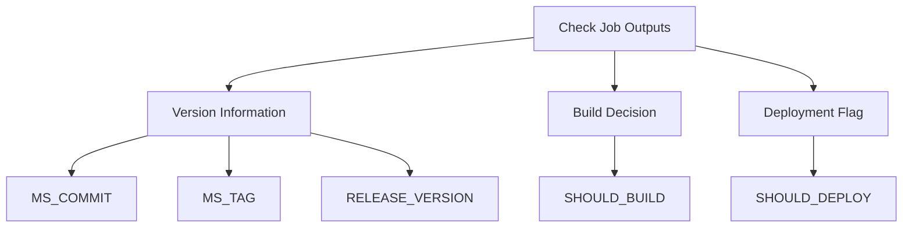
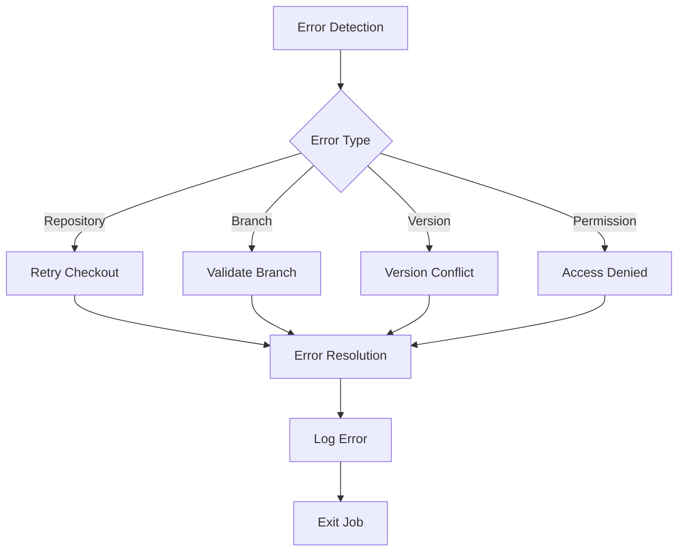

### 1. Check Job

The Check Job serves as the initial validation and setup phase of the pipeline. For a detailed analysis of the Check Job, including its configuration, step-by-step process, error handling, and best practices, please refer to the dedicated documentation:

[Check Job Documentation](./linux/check_job.md)

#### Key Points
- Initial validation and setup phase
- Determines build necessity
- Manages version control
- Handles repository synchronization
- Controls pipeline execution flow

#### Quick Reference
```yaml
check:
  name: Check
  runs-on: ubuntu-latest
  outputs:
    MS_COMMIT: ${{ steps.check_tags.outputs.MS_COMMIT }}
    MS_TAG: ${{ steps.check_tags.outputs.MS_TAG }}
    RELEASE_VERSION: ${{ steps.check_tags.outputs.RELEASE_VERSION }}
    SHOULD_BUILD: ${{ steps.check_tags.outputs.SHOULD_BUILD }}
    SHOULD_DEPLOY: ${{ steps.check_tags.outputs.SHOULD_DEPLOY }}
```
---
## Job Architecture

### 1. Check Job

#### 1.1 Purpose and Overview
The Check Job serves as the initial validation and setup phase of the pipeline. It performs critical pre-build checks and determines whether the build process should proceed. This job acts as a gatekeeper, ensuring that only valid and necessary builds are initiated.

#### 1.2 Job Configuration
```yaml
check:
  name: Check
  runs-on: ubuntu-latest
  outputs:
    MS_COMMIT: ${{ steps.check_tags.outputs.MS_COMMIT }}
    MS_TAG: ${{ steps.check_tags.outputs.MS_TAG }}
    RELEASE_VERSION: ${{ steps.check_tags.outputs.RELEASE_VERSION }}
    SHOULD_BUILD: ${{ steps.check_tags.outputs.SHOULD_BUILD }}
    SHOULD_DEPLOY: ${{ steps.check_tags.outputs.SHOULD_DEPLOY }}
```

#### 1.3 Step-by-Step Analysis

##### Step 1: Code Checkout
```yaml
- uses: actions/checkout@v4
```
- **Purpose:** Initializes the repository
- **Actions:**
  - Fetches the latest code
  - Sets up the working directory
  - Configures Git environment
- **Output:** Clean working directory with latest code

##### Step 2: Branch Management
```yaml
- name: Switch to relevant branch
  run: ./get_pr.sh
```
- **Purpose:** Handles branch-specific logic
- **Actions:**
  - Checks for PR-specific branches
  - Validates branch permissions
  - Ensures correct branch context
- **Output:** Proper branch context for build

##### Step 3: Repository Sync
```yaml
- name: Clone VSCode repo
  run: ./get_repo.sh
```
- **Purpose:** Synchronizes with upstream repository
- **Actions:**
  - Clones VS Code repository
  - Updates to specified version
  - Maintains repository state
- **Output:** Updated repository state

##### Step 4: Trigger Validation
```yaml
- name: Check PR or cron
  run: ./check_cron_or_pr.sh
```
- **Purpose:** Validates build trigger
- **Actions:**
  - Checks trigger type (PR/cron/manual)
  - Validates trigger permissions
  - Determines build necessity
- **Output:** Trigger validation status

##### Step 5: Version Check
```yaml
- name: Check existing VSCodium tags/releases
  run: ./check_tags.sh
```
- **Purpose:** Manages version control
- **Actions:**
  - Checks existing tags
  - Validates version numbers
  - Determines if new build needed
- **Output:** Version information and build decision

#### 1.4 Output Analysis



##### Output Variables
1. **MS_COMMIT**
   - Type: String
   - Purpose: Microsoft VS Code commit hash
   - Usage: Version tracking and reproducibility

2. **MS_TAG**
   - Type: String
   - Purpose: Microsoft VS Code version tag
   - Usage: Release version identification

3. **RELEASE_VERSION**
   - Type: String
   - Purpose: VSCodium release version
   - Usage: Package versioning and release management

4. **SHOULD_BUILD**
   - Type: Boolean
   - Purpose: Build decision flag
   - Usage: Controls pipeline execution

5. **SHOULD_DEPLOY**
   - Type: Boolean
   - Purpose: Deployment decision flag
   - Usage: Controls release process

#### 1.5 Error Handling



##### Error Scenarios
1. **Repository Errors**
   - Checkout failures
   - Sync conflicts
   - Permission issues

2. **Branch Errors**
   - Invalid branch
   - Merge conflicts
   - Protection rules

3. **Version Errors**
   - Tag conflicts
   - Version mismatch
   - Release conflicts

4. **Permission Errors**
   - Access denied
   - Token issues
   - Scope limitations

#### 1.6 Best Practices

1. **Validation**
   - Early error detection
   - Comprehensive checks
   - Clear error messages

2. **Performance**
   - Minimal operations
   - Efficient checks
   - Resource optimization

3. **Security**
   - Permission validation
   - Token management
   - Access control

4. **Maintainability**
   - Clear documentation
   - Modular design
   - Easy updates

#### 1.7 Common Issues and Solutions

1. **Version Conflicts**
   - Problem: Duplicate version numbers
   - Solution: Version validation and increment

2. **Branch Issues**
   - Problem: Invalid branch context
   - Solution: Branch validation and cleanup

3. **Permission Problems**
   - Problem: Access denied
   - Solution: Token validation and scope check

4. **Sync Failures**
   - Problem: Repository sync issues
   - Solution: Retry mechanism and validation

// ... existing code ...