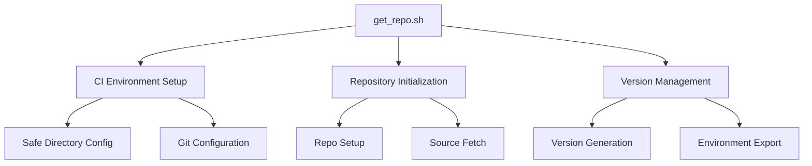
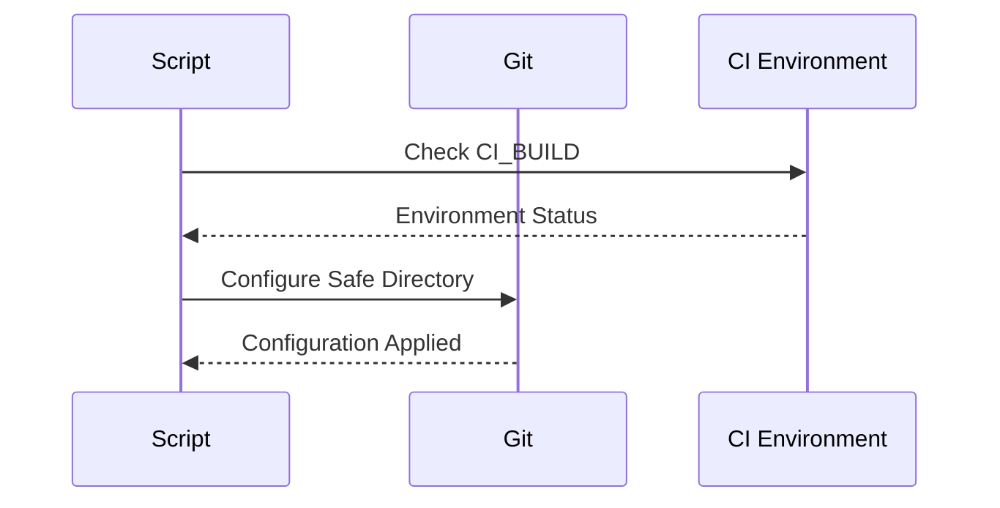
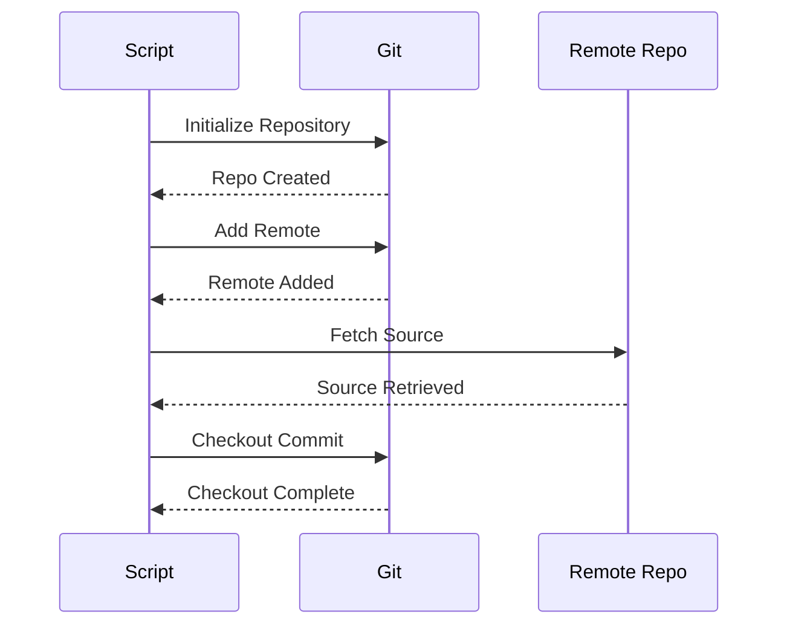
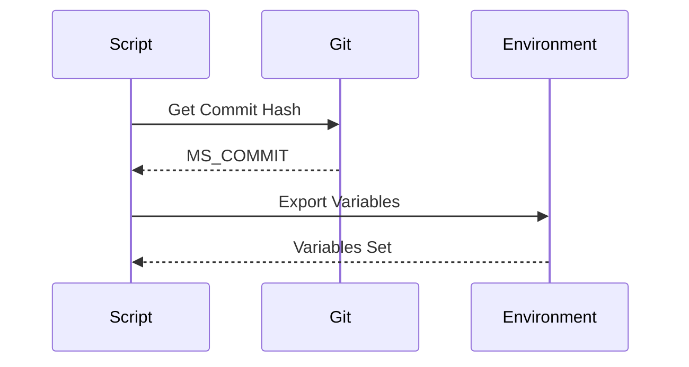
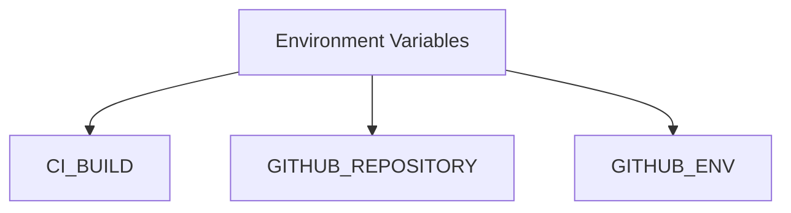
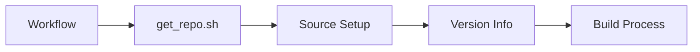
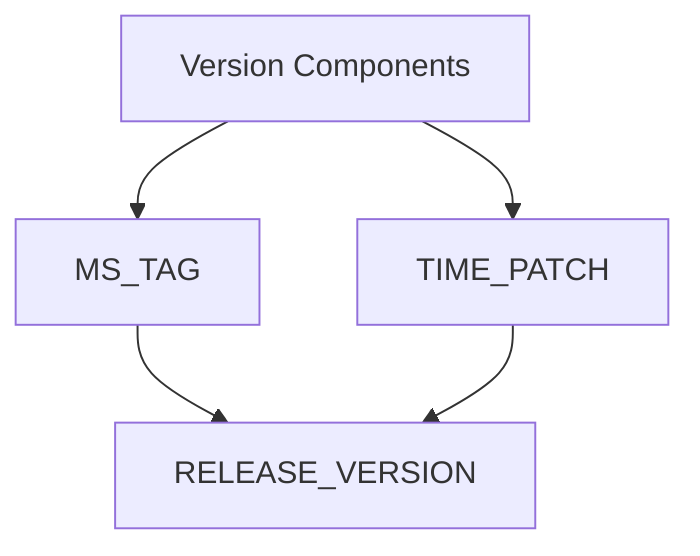
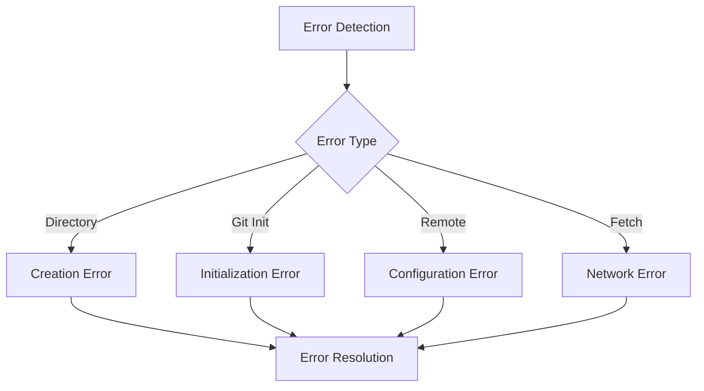

# get_repo.sh Documentation

## Overview
The `get_repo.sh` script is a fundamental component of the VSCodium build pipeline that handles repository initialization, source code synchronization, and version management. It ensures proper setup of the VSCodium source tree and maintains version consistency across the build process.

## Table of Contents
- [Purpose](#purpose)
- [Script Analysis](#script-analysis)
- [Workflow Integration](#workflow-integration)
- [Version Management](#version-management)
- [Error Handling](#error-handling)
- [Security Considerations](#security-considerations)
- [Best Practices](#best-practices)

## Purpose

The script serves three main purposes:
1. **CI Environment Setup**: Configures Git for safe directory access in CI environments
2. **Repository Initialization**: Sets up and initializes the VSCodium source tree
3. **Version Management**: Handles version tracking and release version generation



## Script Analysis

### 1. CI Environment Setup



#### Code Analysis
```bash
if [[ "${CI_BUILD}" != "no" ]]; then
  git config --global --add safe.directory "/__w/$( echo "${GITHUB_REPOSITORY}" | awk '{print tolower($0)}' )"
fi
```

- **Purpose**: Configures Git safe directory in CI environment
- **Components**:
  - CI_BUILD environment variable check
  - Safe directory configuration
  - Repository path normalization
- **Security**: Ensures secure repository access in CI

### 2. Repository Initialization



#### Code Analysis
```bash
DEFAULT_BRANCH="main"
MS_TAG="latest"
TIME_PATCH=$( printf "%04d" $(($(date +%-j) * 24 + $(date +%-H))) )
RELEASE_VERSION="${MS_TAG}${TIME_PATCH}"

mkdir -p vscode
cd vscode || { echo "'vscode' dir not found"; exit 1; }
git init -q
git remote add origin https://github.com/VishalPawar1010/void.git
git fetch --depth 1 origin ${DEFAULT_BRANCH}
git checkout FETCH_HEAD
```

- **Purpose**: Sets up and initializes the VSCodium source tree
- **Components**:
  - Directory creation
  - Git repository initialization
  - Remote repository configuration
  - Source code fetching
  - Commit checkout
- **Process Flow**:
  1. Create vscode directory
  2. Initialize Git repository
  3. Add remote origin
  4. Fetch source code
  5. Checkout latest commit

### 3. Version Management



#### Code Analysis
```bash
MS_COMMIT=$(git rev-parse HEAD)
echo "Using latest commit: $MS_COMMIT"
echo "RELEASE_VERSION=\"${RELEASE_VERSION}\""
echo "MS_TAG=\"${MS_TAG}\""
echo "MS_COMMIT=\"${MS_COMMIT}\""

if [[ "${GITHUB_ENV}" ]]; then
  echo "MS_TAG=${MS_TAG}" >> "${GITHUB_ENV}"
  echo "MS_COMMIT=${MS_COMMIT}" >> "${GITHUB_ENV}"
  echo "RELEASE_VERSION=${RELEASE_VERSION}" >> "${GITHUB_ENV}"
fi

export MS_TAG
export MS_COMMIT
export RELEASE_VERSION
```

- **Purpose**: Manages version information and environment variables
- **Components**:
  - Commit hash retrieval
  - Version string generation
  - Environment variable export
  - GitHub Actions integration
- **Version Generation**:
  - Uses date-based patch number
  - Combines with MS_TAG for release version
  - Ensures unique version strings

## Workflow Integration

### 1. Input Variables



- **CI_BUILD**: Controls CI-specific behavior
- **GITHUB_REPOSITORY**: Repository path for safe directory
- **GITHUB_ENV**: GitHub Actions environment file

### 2. Integration Points



- **Trigger**: Build workflow execution
- **Output**: Prepared source tree and version info
- **Dependencies**: Git configuration
- **Next Steps**: Build process initiation

## Version Management

### 1. Version Generation Strategy



- **MS_TAG**: Base version identifier
- **TIME_PATCH**: Date-based patch number
- **RELEASE_VERSION**: Combined version string

### 2. Version Tracking
- Commit hash tracking
- Version string generation
- Environment variable management

## Error Handling

### 1. Error Scenarios



### 2. Error Prevention
- Directory existence check
- Git operation validation
- Network operation verification
- Environment variable validation

## Security Considerations

### 1. Access Control
- Safe directory configuration
- Repository access validation
- Secure Git operations

### 2. Data Protection
- Version information security
- Environment variable management
- Secure repository access

## Best Practices

### 1. Configuration
- Use environment variables
- Validate inputs
- Secure Git operations

### 2. Error Handling
- Early error detection
- Clear error messages
- Graceful failure handling

### 3. Performance
- Minimal Git operations
- Efficient directory management
- Optimized fetch strategy

## Common Issues and Solutions

### 1. Permission Issues
- **Problem**: Safe directory access denied
- **Solution**: Proper CI configuration

### 2. Network Issues
- **Problem**: Repository fetch failures
- **Solution**: Retry mechanism

### 3. Version Conflicts
- **Problem**: Version string generation issues
- **Solution**: Proper time synchronization

## Usage Examples

### 1. Basic Usage
```bash
export CI_BUILD=yes
./get_repo.sh
```

### 2. Custom Configuration
```bash
export GITHUB_REPOSITORY=owner/repo
./get_repo.sh
```

## Maintenance

### 1. Version Control
- Track script changes
- Document modifications
- Test updates

### 2. Testing
- CI environment testing
- Version generation testing
- Error case testing

---

*This documentation provides a comprehensive overview of the get_repo.sh script, its functionality, and integration within the VSCodium build pipeline.* 