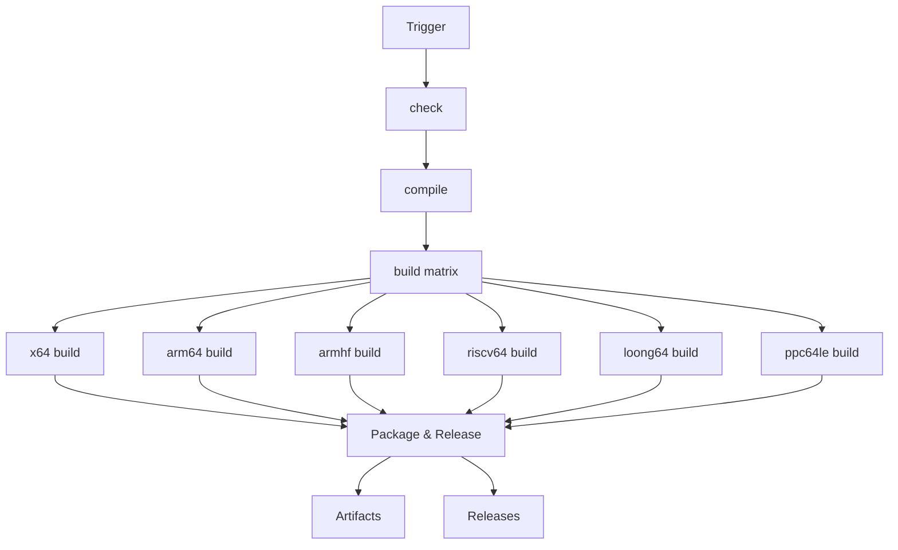
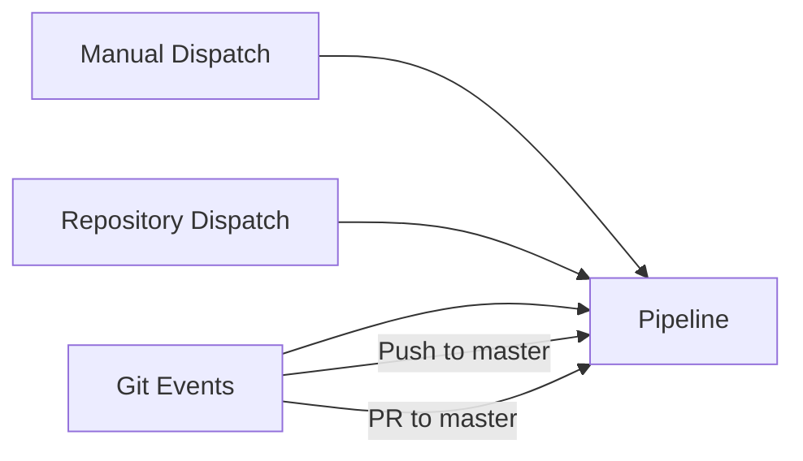

# Table of Contents

- [Table of Contents](#table-of-contents)
- [Introduction](#introduction)
  - [1.1 Who Should Read This?](#11-who-should-read-this)
  - [1.2 Key Takeaways](#12-key-takeaways)
- [2. Repository Overview](#2-repository-overview)
  - [2.a Monorepo Structure](#2a-monorepo-structure)
  - [2.b Key Directories and Files](#2b-key-directories-and-files)
- [3. Linux Pipeline Overview](#3-linux-pipeline-overview)
  - [3.1 Pipeline Architecture](#31-pipeline-architecture)
  - [3.2 Pipeline Stages](#32-pipeline-stages)
    - [Stage 1: Pre-build (check)](#stage-1-pre-build-check)
    - [Stage 2: Compilation (compile)](#stage-2-compilation-compile)
    - [Stage 3: Multi-arch Build (build matrix)](#stage-3-multi-arch-build-build-matrix)
    - [Stage 4: Packaging \& Release](#stage-4-packaging--release)
  - [3.3 Pipeline Triggers](#33-pipeline-triggers)
  - [3.4 Key Design Principles](#34-key-design-principles)
  - [3.5 Build Matrix Configuration](#35-build-matrix-configuration)
- [4. Linux Pipeline Analysis](#4-linux-pipeline-analysis)
- [5. Conclusion](#5-conclusion)
  - [5.1 Key Achievements](#51-key-achievements)
  - [5.2 Lessons for AI/IDE Development](#52-lessons-for-aiide-development)
  - [5.3 Future Directions](#53-future-directions)
  - [5.4 Final Thoughts](#54-final-thoughts)

# Introduction

In the rapidly evolving landscape of software development, the integration of artificial intelligence into integrated development environments (IDEs) has become a game-changer. Startups like Cursor, Windsurf, Pieces for Developers, GitHub Copilot, and many more are at the forefront of this revolution, leveraging large language models to enhance developer productivity.

A common strategy among these innovators involves forking open-source projects such as Visual Studio Code (VS Code) and its telemetry-free counterpart, VSCodium. This approach allows for extensive customization to meet specific AI integration needs. However, modifying these complex codebases introduces challenges, particularly in maintaining robust and efficient Continuous Integration and Continuous Deployment (CI/CD) pipelines.

This article aims to demystify the CI/CD processes underpinning VSCodium, providing a comprehensive guide for developers and startups embarking on similar journeys. By understanding the intricacies of VSCodium's build and deployment mechanisms, teams can ensure smoother development cycles and more reliable product releases.

## 1.1 Who Should Read This?
- **AI/DevTool Startup Engineers:** If you're building AI-powered IDE features or forking VSCode/VSCodium, this guide is for you.
- **DevOps/CI Maintainers:** Anyone responsible for keeping the build green and releases flowing.
- **Open Source Contributors:** Developers new to VSCodium or VSCode forks who want to understand the build pipeline.
- **Technical Leaders:** CTOs, architects, or project leads evaluating the complexity of integrating or customizing VSCode for AI use cases.

## 1.2 Key Takeaways
- **End-to-End Understanding:** Gain a complete mental model of how VSCodium's CI/CD works, from commit to release artifact.
- **Customization Roadmap:** See how to safely adapt the pipeline for your own AI/LLM integrations.
- **Reusable Insights:** The lessons here apply to any VSCode-based fork, not just VSCodium.

# 2. Repository Overview

VSCodium: [GitHub](https://github.com/VSCodium/vscodium/blob/master/README.md)

VSCodium's CI/CD lives in a monorepo of build scripts that wrap Microsoft's VS Code sources—rather than forking the code itself—so that any changes or upstream updates flow through the same automation logic. All workflows sit under `.github/workflows` with separate YAML files for each platform (`windows`, `linux`, `macos`) and release channel. We will take the Linux pipeline as our primary example.

## 2.a Monorepo Structure
VSCodium maintains a **monorepo** (single repository) approach, which means all build scripts, configuration, documentation, and packaging logic live alongside each other. This design enables:
- **Atomic Changes:** Updates to scripts, docs, and configs can be made in one PR, reducing drift.
- **Centralized Automation:** All CI/CD logic is versioned and discoverable in one place.
- **Easier Upstream Sync:** Since the repo wraps VS Code sources, upstream updates can be integrated with minimal disruption to customizations.

## 2.b Key Directories and Files
- `.github/workflows/`: Contains all GitHub Actions workflow YAMLs for CI/CD, separated by OS and release channel.
- `dev/`: Main build orchestration scripts (e.g., `build.sh`), invoked by workflows.
- `src/`: Contains VSCodium-specific files and resources to be merged into the VS Code source tree.
- `prepare_vscode.sh`, `get_repo.sh`, `update_settings.sh`, etc.: Modular shell scripts that handle source preparation, repo syncing, and configuration updates.
- `docs/`: In-depth documentation for scripts, pipeline logic, and contributor guidance.

# 3. Linux Pipeline Overview

The Linux pipeline for VSCodium is defined in the `stable-linux.yml` workflow file under `.github/workflows/`. This pipeline is responsible for building, packaging, and publishing VSCodium for various Linux distributions and CPU architectures. The workflow is designed for scalability, reproducibility, and maintainability, leveraging Docker containers and a build matrix to ensure consistent results across environments.

## 3.1 Pipeline Architecture

The pipeline follows a multi-stage architecture with parallel execution paths:



## 3.2 Pipeline Stages

### Stage 1: Pre-build (check)
- **Purpose:** Initial setup and validation
- **Key Activities:**
  - Code checkout
  - Branch management
  - Upstream repository sync
  - Pre-build validation
  - Version/tag verification

### Stage 2: Compilation (compile)
- **Purpose:** Core build process
- **Key Activities:**
  - Environment setup
  - Dependency installation
  - Source compilation
  - Artifact generation

### Stage 3: Multi-arch Build (build matrix)
- **Purpose:** Parallel architecture-specific builds
- **Supported Architectures:**
  - x64 (Intel/AMD)
  - arm64 (ARM 64-bit)
  - armhf (ARM 32-bit)
  - riscv64 (RISC-V)
  - loong64 (LoongArch)
  - ppc64le (PowerPC)

### Stage 4: Packaging & Release
- **Purpose:** Distribution preparation
- **Output Formats:**
  - .deb (Debian/Ubuntu)
  - .rpm (Fedora/RHEL)
  - .AppImage (Portable)
  - .tar.gz (Generic)
  - .snap (Snapcraft)

## 3.3 Pipeline Triggers

The pipeline can be initiated through multiple channels:



## 3.4 Key Design Principles

1. **Isolation**
   - Each build runs in a dedicated Docker container
   - Architecture-specific toolchains and dependencies
   - Clean environment for each job

2. **Parallelism**
   - Matrix builds for multiple architectures
   - Independent job execution
   - Optimized resource utilization

3. **Reproducibility**
   - Pinned dependencies
   - Version-controlled build scripts
   - Consistent environment setup

4. **Scalability**
   - Modular job structure
   - Easy addition of new architectures
   - Flexible packaging options

## 3.5 Build Matrix Configuration

The pipeline uses a sophisticated matrix strategy to handle multiple architectures:

```yaml
strategy:
  matrix:
    arch: [x64, arm64, armhf, riscv64, loong64, ppc64le]
    include:
      - arch: x64
        docker_image: mcr.microsoft.com/vscode/devcontainers/base:ubuntu
      - arch: arm64
        docker_image: multiarch/ubuntu-core:arm64-bionic
      # ... additional architecture configurations ...
```

This configuration ensures that each architecture build:
- Uses the appropriate container image
- Has access to the correct toolchain
- Maintains isolation from other builds
- Can be scaled independently

---

*Next: We'll dive into the detailed analysis of each pipeline stage and its components.*

# 4. Linux Pipeline Analysis

This section provides a detailed technical analysis of the Linux pipeline, breaking down each component and its role in the build process. For the most up-to-date implementation details, refer to [WORKFLOW_STABLE_LINUX.md](./WORKFLOW_STABLE_LINUX.md).


# 5. Conclusion

The VSCodium CI/CD pipeline represents a sophisticated and well-designed system that addresses the complex challenges of building and distributing a modern IDE across multiple platforms and architectures. Through this documentation, we've explored its architecture, design principles, and implementation details.

## 5.1 Key Achievements

1. **Robust Multi-Architecture Support**
   - Comprehensive coverage of major CPU architectures
   - Efficient parallel build system
   - Consistent output quality across platforms

2. **Modern DevOps Practices**
   - Containerized build environments
   - Automated testing and validation
   - Streamlined release management

3. **Scalable Architecture**
   - Modular design for easy extension
   - Efficient resource utilization
   - Flexible deployment options

## 5.2 Lessons for AI/IDE Development

For teams building AI-powered IDEs or customizing VSCode/VSCodium:

1. **Build System Design**
   - Invest in a robust CI/CD pipeline early
   - Design for multiple architectures from the start
   - Implement proper isolation and testing

2. **Maintenance Considerations**
   - Keep build scripts modular and well-documented
   - Maintain clear separation between core and custom code
   - Regular updates to dependencies and toolchains

3. **Release Management**
   - Implement automated versioning
   - Maintain multiple distribution channels
   - Ensure consistent quality across platforms

## 5.3 Future Directions

The VSCodium pipeline continues to evolve, with potential future enhancements including:

1. **Enhanced Testing**
   - Integration of AI-powered testing tools
   - Automated performance benchmarking
   - Expanded test coverage

2. **Build Optimization**
   - Caching improvements
   - Parallel build enhancements
   - Resource optimization

3. **Distribution Expansion**
   - Additional package formats
   - New platform support
   - Improved update mechanisms

## 5.4 Final Thoughts

The VSCodium pipeline serves as an excellent example of how to build and maintain a complex, multi-platform software distribution system. Its design principles and implementation details provide valuable insights for:

- Teams building AI-powered development tools
- Organizations maintaining large-scale open-source projects
- Developers working on cross-platform applications

By understanding and potentially adopting these patterns, teams can build more robust, maintainable, and scalable CI/CD systems for their own projects.

---

